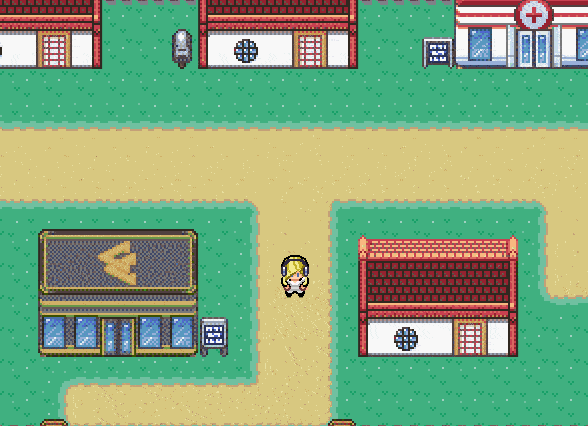
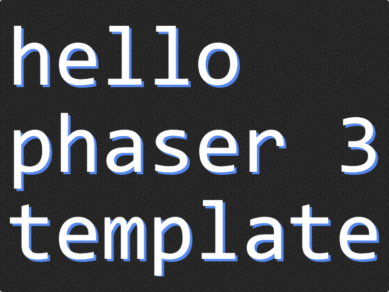
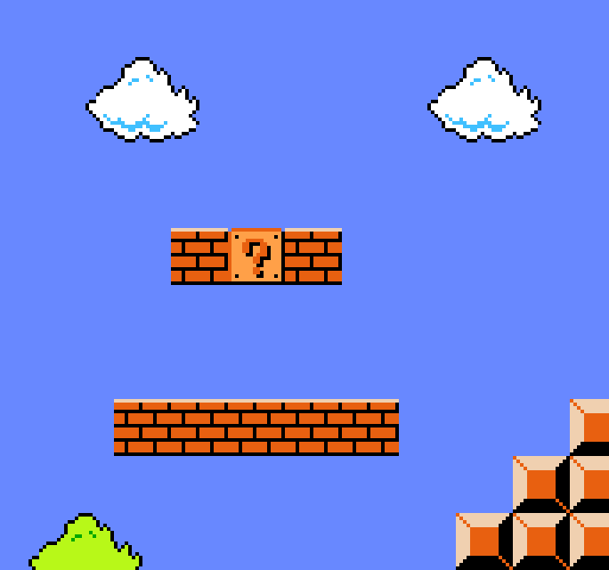
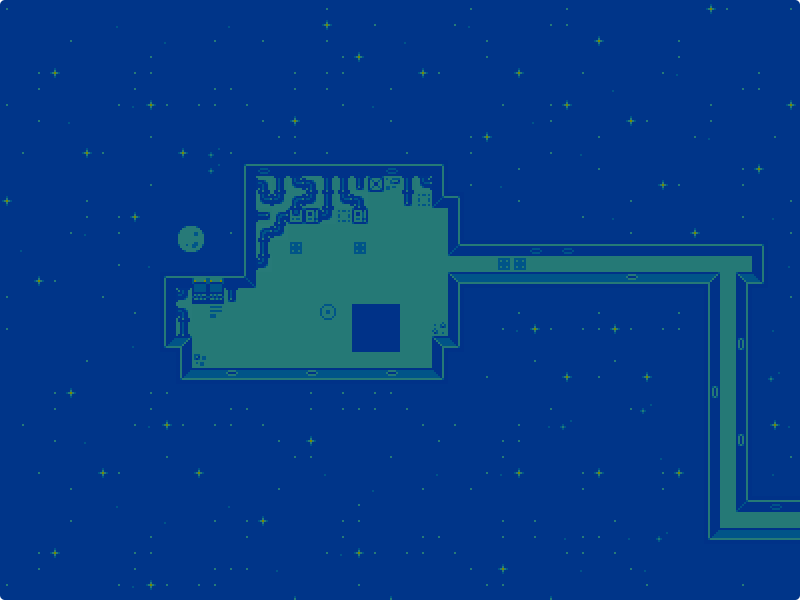
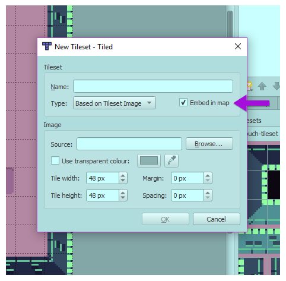
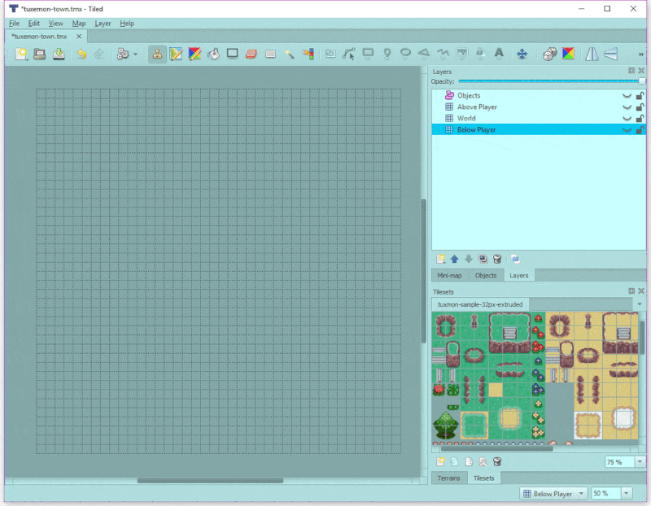
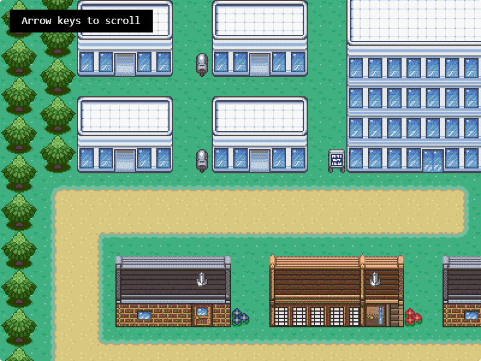
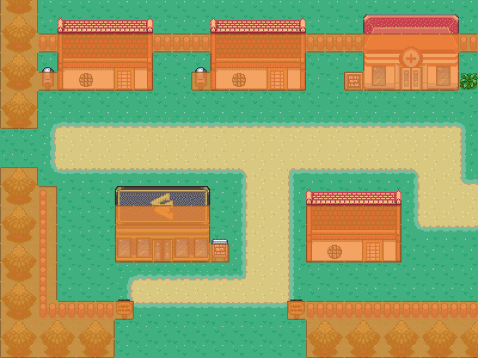
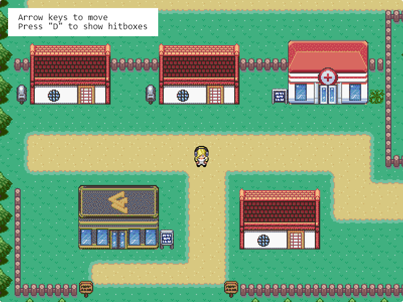

# Modular Game Worlds in Phaser 3 (Tilemaps #1) — Static Maps

Author: [Mike Hadley](https://www.mikewesthad.com/)

Reading this on GitHub? Check out the [Medium Post](https://medium.com/@michaelwesthadley/modular-game-worlds-in-phaser-3-tilemaps-1-958fc7e6bbd6)

This is a series of blog posts about creating modular worlds with tilemaps in the [Phaser 3](http://phaser.io/) game engine. In this first post, we'll go from zero to creating a Pokemon-style top down game world that a player can explore:



_↳ Final example that we'll create_

The next planned post will cover how to create procedurally generated and dynamic maps, and the final post will show you how to create a physics-y platformer with [Matter.js](http://brm.io/matter-js/).

Before we dive in, all the code that goes along with this post is in [this repository](https://github.com/mikewesthad/phaser-3-tilemap-blog-posts/tree/master/examples/post-1).

## Why

I'm a creative developer and educator at [Convergence Design Lab](https://convergencedesignlab.org/), but I was brought on to the Phaser team in the sprint leading up to the initial public v3 release to develop the Tilemap API. I created ~40 guided examples and wrote weekly newsletter updates, but I wanted to collect all of that information into a more guided and digestible format so that people can more easily jump into Phaser 3.

## What is a Tilemap

A tilemap is a technique for creating a game world out of modular building blocks. When you break a world down into lego-like pieces, you get memory, performance and creative wins.

Imagine trying to recreate Mario from scratch. Let's say we decide to try loading each level as a giant image file. World 1-1 would be over 3500px wide:


_↳ [Image Source](http://www.mariouniverse.com/maps-nes-smb/)_

We'd need a lot of pixels to store that first level and the other 31 levels in the NES game as images. Additionally, it would be hard to sync up the image with logic with the game. Which pixels can Mario stand on? Which pixels correspond to pipes he can enter?

The tilemap approach defines a set of modular, regularly-sized _tiles_ that we can use to build our levels. That way, we only need one image, a _tileset_:


_↳ [Source](http://rmrk.net/index.php?topic=37002.0): Tileset by Nintendo, remixed by Arrow_

So that 304px x 192px image holds the possibility of recreating all the levels of the original mario game, plus any new levels you can imagine. (*Of course, you'd still be missing a mustached man and a bipedal turtle, among other things.) Each tile is just 16 x 16 pixels. An arrangement of those tiles into a level is called a _tilemap_. With tilemap editing software, we can easily configure properties of the tiles too. For example, we can mark some tiles - like the ground tiles - as solid tiles that Mario can stand on.

So with tilemaps, we've got a smaller image (performance & memory win) that we can use to easily create and iterate on level designs (creative win).

## Phaser 3 Basic Template

Before we jump into loading up some tilemaps in code, let's take a look at the structure of a Phaser 3 game. In v3, games are structured around [`Scene` objects](https://phaser.io/phaser3/contributing/part5). These are like `State` objects from v2, but more flexible.

```js
const config = {
  type: Phaser.AUTO, // Which renderer to use
  width: 800, // Canvas width in pixels
  height: 600, // Canvas height in pixels
  parent: "game-container", // ID of the DOM element to add the canvas to
  scene: {
    preload: preload,
    create: create,
    update: update
  }
};

const game = new Phaser.Game(config);

function preload() {
  // Runs once, loads up assets like images and audio
}

function create() {
  // Runs once, after all assets in preload are loaded
}

function update(time, delta) {
  // Runs once per frame for the duration of the scene
}
```
<!-- https://gist.github.com/mikewesthad/bdcebf6276a1b3affb457fcbbe238d4a -->

This is a template that you'll see throughout the Phaser examples repository. It's an easy way to get started. It creates a game and defines a scene as a collection of functions - `preload`, `create` and `update`.

Here's a slightly more complicated example that shows how to load and create a background and some text:



_↳ Check out the [codepen](https://codepen.io/mikewesthad/pen/KeLwLW), [live example](https://www.mikewesthad.com/phaser-3-tilemap-blog-posts/post-1/00-phaser-3-template/) or the source code [here](https://github.com/mikewesthad/phaser-3-tilemap-blog-posts/blob/master/examples/post-1/00-phaser-3-template/index.js)._

There might be a lot of new concepts in this series if you haven't used Phaser, so check out the extensive [examples](https://labs.phaser.io/) and [documentation](https://photonstorm.github.io/phaser3-docs/index.html) if you get lost.

## First Step

Let's start with the simplest setup and re-create a mini-mario level using this stripped down Mario tileset:


We'll start with the boilerplate from the last section. Inside of preload, we can load up the tileset image:

```js
function preload() {
  this.load.image("mario-tiles", "../assets/tilesets/super-mario-tiles.png");
}
```
<!-- https://gist.github.com/mikewesthad/2df3f7aee2bfe9f9b240f07e4fb788aa -->

`this` refers to our current scene and `this.load` is the scene's loader which handles, well, the loading of assets. The `create` function won't get run until after all the assets in `preload` are done loading.

```js
function create() {
  // Load a map from a 2D array of tile indices
  const level = [
    [  0,   0,   0,   0,   0,   0,   0,   0,   0,   0,   0 ],
    [  0,   1,   2,   3,   0,   0,   0,   1,   2,   3,   0 ],
    [  0,   5,   6,   7,   0,   0,   0,   5,   6,   7,   0 ],
    [  0,   0,   0,   0,   0,   0,   0,   0,   0,   0,   0 ],
    [  0,   0,   0,  14,  13,  14,   0,   0,   0,   0,   0 ],
    [  0,   0,   0,   0,   0,   0,   0,   0,   0,   0,   0 ],
    [  0,   0,   0,   0,   0,   0,   0,   0,   0,   0,   0 ],
    [  0,   0,  14,  14,  14,  14,  14,   0,   0,   0,  15 ],
    [  0,   0,   0,   0,   0,   0,   0,   0,   0,  15,  15 ],
    [ 35,  36,  37,   0,   0,   0,   0,   0,  15,  15,  15 ],
    [ 39,  39,  39,  39,  39,  39,  39,  39,  39,  39,  39 ]
  ];

  // When loading from an array, make sure to specify the tileWidth and tileHeight
  const map = this.make.tilemap({ data: level, tileWidth: 16, tileHeight: 16 });
  const tiles = map.addTilesetImage("mario-tiles");
  const layer = map.createStaticLayer(0, tiles, 0, 0);
}
```
<!-- https://gist.github.com/mikewesthad/4db65ee45e0cd9a6905e95f5323eaa9c -->

`level` is just a 2D array of numbers, or _indices_, that point to a specific tile from our tileset. 0 is the top left tile, 1 is the one next to it, etc.


_↳ Mapping from tileset index to tile_

Note: an index that is less than zero is considered an empty tile.



_↳ Check out the [codepen](https://codepen.io/mikewesthad/pen/VdOLge), [live example](https://www.mikewesthad.com/phaser-3-tilemap-blog-posts/post-1/01-array) or the source code [here](https://github.com/mikewesthad/phaser-3-tilemap-blog-posts/blob/master/examples/post-1/01-array/index.js)._

Breaking down that code, we've got three main parts: a [`Tilemap`](https://photonstorm.github.io/phaser3-docs/Phaser.Tilemaps.Tilemap.html), a [`Tileset`](https://photonstorm.github.io/phaser3-docs/Phaser.Tilemaps.Tileset.html) and a [`StaticTilemapLayer`](https://photonstorm.github.io/phaser3-docs/Phaser.Tilemaps.StaticTilemapLayer.html). You create a `Tilemap` through [`this.make.tilemap`](https://photonstorm.github.io/phaser3-docs/Phaser.GameObjects.GameObjectCreator.html#tilemap) (or [`this.add.tilemap`](https://photonstorm.github.io/phaser3-docs/Phaser.GameObjects.GameObjectFactory.html#tilemap)). This isn't a display object, rather, it holds data about the map and allows you to add tilesets & tilemap layers.

A map can have one or more layers, which are the display objects that actually render tiles from a `Tileset`. They come in two flavors: `StaticTilemapLayer` & `DynamicTilemapLayer`. A `StaticTilemapLayer` is super fast, but the tiles in that layer can't be modified. A `DynamicTilemapLayer` trades some speed for the flexibility and power of manipulating individual tiles. For this post, we'll stick to static layers, but next time, we'll dive into dynamic layers.

## Loading from a File: CSV

In addition to loading a map from a 2D array, you can also load it from a CSV:

```js
function preload() {
  this.load.image("tiles", "../assets/catastrophi_tiles_16_blue.png");
  this.load.tilemapCSV("map", "../assets/catastrophi_level2.csv");
}

function create() {
  // When loading a CSV map, make sure to specify the tileWidth and tileHeight!
  const map = this.make.tilemap({ key: "map", tileWidth: 16, tileHeight: 16 });
  const tileset = map.addTilesetImage("tiles");
  const layer = map.createStaticLayer(0, tileset, 0, 0); // layer index, tileset, x, y
}
```
<!-- https://gist.github.com/mikewesthad/9dd70a10b84d1d4cd13a71a5059106d1 -->

Note: this example is basically a copy of a Phaser [example](https://labs.phaser.io/view.html?src=src/game%20objects/tilemap/static/csv-map.js) which features Rich Davey & Ilija Melentijević's [Cat Astro Phi](http://www.photonstorm.com/games/cat-astro-phi) assets.



_↳ Check out the [codepen](https://codepen.io/mikewesthad/pen/zaQvYV), [live example](https://www.mikewesthad.com/phaser-3-tilemap-blog-posts/post-1/02-csv) or the source code [here](https://github.com/mikewesthad/phaser-3-tilemap-blog-posts/blob/master/examples/post-1/02-csv/index.js)._

We can easily add some interactivity here by letting the player pan around the world using Phaser's camera system. The code is commented to explain the new pieces of Phaser used, but check out the Phaser [camera examples](https://labs.phaser.io/index.html?dir=camera/&q=) for more on cameras.


_↳ Check out the [codepen](https://codepen.io/mikewesthad/pen/rKgOxE), [live example](https://www.mikewesthad.com/phaser-3-tilemap-blog-posts/post-1/03-csv-camera) or the source code [here](https://github.com/mikewesthad/phaser-3-tilemap-blog-posts/blob/master/examples/post-1/03-csv-camera/index.js)._

## Building a Map in Tiled

Loading from a 2D array or CSV is great when you want to test out something simple or you are generating a procedural world, but odds are, you'll want a level design tool. That's where [Tiled](https://www.mapeditor.org/) comes in. It's a free, open source tilemap editor that can export to CSV, JSON and a bunch of other formats.

We won't dive into how to use Tiled - that's an expansive topic by itself - so check out Tiled's [documentation](http://docs.mapeditor.org/en/stable/manual/introduction/) and the Game from Scratch [tutorial series](http://www.gamefromscratch.com/post/2015/10/14/Tiled-Map-Editor-Tutorial-Series.aspx) for a crash course. You can also download the tilemaps (.tmx files) and tilesets from the demos [here](https://github.com/mikewesthad/phaser-3-tilemap-blog-posts/tree/master/examples/post-1/assets). Open them up, play around and you should get the hang of it.

When working with Tiled to generate maps for Phaser, there are a few things you'll want to make sure to do:

1. When you load a tileset into your map, make sure to check the "Embed in map" option. (If you forget to do this, then you can click the embed tileset button the bottom of the screen.) See first two images below.
2. Make sure you aren't using a compressed "Tile Layer Format." You can adjust that in map properties sidebar... which you can open by hitting "Map → Map Properties" in the top toolbar. See third image below.
3. When you export your map, save it as a JSON file.



_↳ Embedding a tileset when creating it_


_↳ Embedding a tileset AFTER creating it_


_↳ Changing the tilemap format_

## Loading a Tiled Map

Using the `tilemapTiledJSON` loader method, we can load up and display a tilemap that we've exported from Tiled:

```js
function preload() {
  this.load.image("tiles", "../assets/tilesets/tuxmon-sample-32px-extruded.png");
  this.load.tilemapTiledJSON("map", "../assets/tilemaps/tuxemon-town.json");
}

function create() {
  // Parameters are the name you gave the tileset in Tiled and then the key of the tileset image in
  // Phaser's cache (i.e. the name you used in preload)
  const tileset = map.addTilesetImage("tuxmon-sample-32px-extruded", "tiles");

  // Parameters: layer name (or index) from Tiled, tileset, x, y
  const belowLayer = map.createStaticLayer("Below Player", tileset, 0, 0);
  const worldLayer = map.createStaticLayer("World", tileset, 0, 0);
  const aboveLayer = map.createStaticLayer("Above Player", tileset, 0, 0);
}
```
<!-- https://gist.github.com/mikewesthad/1a97793b85bedaea004298ac3328e2f9 -->

This step is mainly about connecting up data. To help making the naming slightly more clear, here's where the names come from:


You'll notice that the map is composed of multiple layers placed on top of one another:



This is a common design pattern when working with Tiled. It allows us to separate out elements to be placed at different "depths" in the game. With these layers, we can ensure the "Below Player" layer (the ground & path) are displayed under the player sprite and the "Above Player" layer (roof/statue/sign tops) are displayed on top of the player sprite. The "World" layer has all the rest of the stuff, including the colliding/solid stuff in the world.

If we add in our camera code, we end up with:



_↳ Check out the [codepen](https://codepen.io/mikewesthad/pen/oyRjZz), [live example](https://www.mikewesthad.com/phaser-3-tilemap-blog-posts/post-1/04-tiled) or the source code [here](https://github.com/mikewesthad/phaser-3-tilemap-blog-posts/blob/master/examples/post-1/04-tiled/index.js)._

## Moving with Physics

Now that we've got a world, we can add a proper character to the world and have them walk around with physics. There are currently three physics engines that are integrated into Phaser: arcade physics (AP), matter.js and impact. AP is fast and simple, so that's where we'll start - we'll get to matter.js later.

In AP, you can create physics bodies that are either rectangles or circles. Rectangle bodies are [axis-aligned bounding boxes](https://www.gamasutra.com/view/feature/131833/when_two_hearts_collide_.php), which roughly means they can't be rotated. Colliding tiles in our map loaded up with AP will be given a rectangular body that matches the size of the tile.

There are four things we'll need to do:

1. Mark certain tiles in the `worldLayer` as colliding so that AP knows to use them for collisions.
2. Enable the AP physics engine.
3. Create a physics-based sprite for the player.
4. Set the player to collide with the `worldLayer`.

The first step to use a tilemap with physics is that you need to mark which tiles should be solid ("colliding"). One way to do that would be to mark certain tile indices as colliding within a layer:

```js
// The 13th tile through and including the 45th tile will be marked as colliding
worldLayer.setCollisionBetween(12, 44);
```
<!-- https://gist.github.com/mikewesthad/12615aff87a16c1baa3f1919cbf04d24 -->

If you are working with tile indices, then there's [`setCollision`](https://photonstorm.github.io/phaser3-docs/Phaser.Tilemaps.Tilemap.html#setCollision__anchor), [`setCollisionBetween`](https://photonstorm.github.io/phaser3-docs/Phaser.Tilemaps.Tilemap.html#setCollisionBetween__anchor) and [`setCollisionByExclusion`](https://photonstorm.github.io/phaser3-docs/Phaser.Tilemaps.Tilemap.html#setCollisionByExclusion__anchor). But thinking in terms of indices is hard, so there's a better way: [`setCollisionByProperty`](https://photonstorm.github.io/phaser3-docs/Phaser.Tilemaps.Tilemap.html#setCollisionByProperty__anchor). Tiled allows you to add properties to a tileset via the [Tileset Editor](http://docs.mapeditor.org/en/latest/manual/editing-tilesets/), so we can just mark which tiles collide directly in Tiled.

Steps (or see GIF below):

1.  Open up the Tileset Editor by clicking on the "Edit Tileset" button (at the bottom right of screen).
2.  Click and drag (or CTRL + A) to select all the tiles.
3.  Under the properties window (left side of screen), click the plus icon and add a boolean property named "collides."
4.  Select only the tiles that you want to collide and set "collides" to true by checking the box
5.  Re-export your map.


Back inside of Phaser, we can simply do the following to mark our colliding tiles within `worldLayer`:

```js
worldLayer.setCollisionByProperty({ collides: true });
```
<!-- https://gist.github.com/mikewesthad/6e131f6ed11c18114aa482715e8a4779 -->

If you want to verify that you've got the right tiles marked as colliding, use the layer's debug rendering:

```js
const debugGraphics = this.add.graphics().setAlpha(0.75);
worldLayer.renderDebug(debugGraphics, {
  tileColor: null, // Color of non-colliding tiles
  collidingTileColor: new Phaser.Display.Color(243, 134, 48, 255), // Color of colliding tiles
  faceColor: new Phaser.Display.Color(40, 39, 37, 255) // Color of colliding face edges
});
```
<!-- https://gist.github.com/mikewesthad/6f9a777bf8e7c5ae37436558e81a6673 -->

Which will look like this:



Once we've got tiles marked as colliding, we can add physics. In our game's config, we can turn on the arcade physics engine by doing the following:

```js
var config = {
  // ... (rest of the config from earlier)
  physics: {
    default: "arcade",
    arcade: {
      gravity: { y: 0 } // Top down game, so no gravity
    }
  }
};
```
<!-- https://gist.github.com/mikewesthad/4aad4dad2f610ac61b7ed8f4bffa1827 -->

We can create a simple player sprite that moves around using physics:

```js
let player;

function create() {
  player = this.physics.add.sprite(400, 350, "atlas", "misa-front");
}

function update(time, delta) {
  // Stop any previous movement from the last frame
  player.body.setVelocity(0);

  // Horizontal movement
  if (cursors.left.isDown) {
    player.body.setVelocityX(-100);
  } else if (cursors.right.isDown) {
    player.body.setVelocityX(100);
  }

  // Vertical movement
  if (cursors.up.isDown) {
    player.body.setVelocityY(-100);
  } else if (cursors.down.isDown) {
    player.body.setVelocityY(100);
  }

  // Normalize and scale the velocity so that player can't move faster along a diagonal
  player.body.velocity.normalize().scale(speed);
}
```
<!-- https://gist.github.com/mikewesthad/b8e145be9b1dc7230663a951b219f523 -->

Note: I'm using a texture atlas here. See this [tutorial](https://www.codeandweb.com/texturepacker/tutorials/how-to-create-sprite-sheets-for-phaser3) for more info.

The last step is to collide the player and the tilemap layer against one another. We could use [`collide`](https://photonstorm.github.io/phaser3-docs/Phaser.Physics.Arcade.World.html#collide__anchor) or [`addCollider`](https://photonstorm.github.io/phaser3-docs/Phaser.Physics.Arcade.World.html#addCollider__anchor). We'll go with the latter:

```js
function setup() {
  // ...

  // This will watch the player and worldLayer every frame to check for collisions
  this.physics.add.collider(player, worldLayer);
}
```
<!-- https://gist.github.com/mikewesthad/39dc31804710addeeeeffe3a3df362d8 -->

And putting it all together, with a few extras like adding in player animations:



_↳ Check out the [codepen](https://codepen.io/mikewesthad/pen/BVeoYP), [live example](https://www.mikewesthad.com/phaser-3-tilemap-blog-posts/post-1/05-physics) or the source code [here](https://github.com/mikewesthad/phaser-3-tilemap-blog-posts/blob/master/examples/post-1/05-physics/index.js)._

There's a whole lot of powerful stuff you can do with Tiled and Phaser to make the creative process of developing a game world easier. For example, the code for this section uses an [object layer](http://docs.mapeditor.org/en/stable/manual/objects/) to embed the player's spawn point directly in the map.


```js
const spawnPoint = map.findObject("Objects", obj => obj.name === "Spawn Point");
player = this.physics.add.sprite(spawnPoint.x, spawnPoint.y, "atlas", "misa-front");
```
<!-- https://gist.github.com/mikewesthad/da659a2dc99f67f9f7388f6c7f0ee146 -->

But that's just scratching the surface! Keep an eye out for the next post, where we'll dive into dynamic tilemap layers and creating a procedural dungeon.

## Addendum on Tile Bleeding

You may have noticed the word "extruded" in the name of the tileset in the last two sections. If you ever notice a slight "bleeding" in your tilemap where you start to see the seams between your tiles, one way to solve that is to extrude your tiles using a small command line utility I wrote called [tile-extruder](https://github.com/sporadic-labs/tile-extruder).