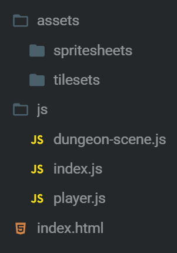
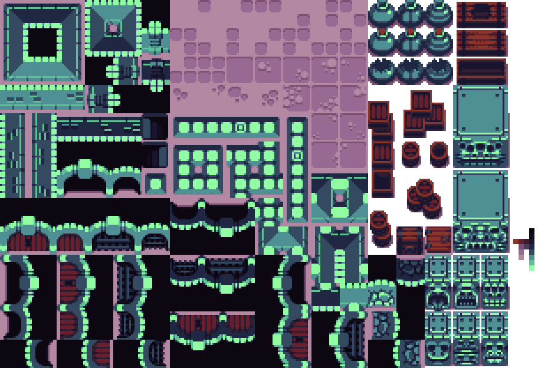
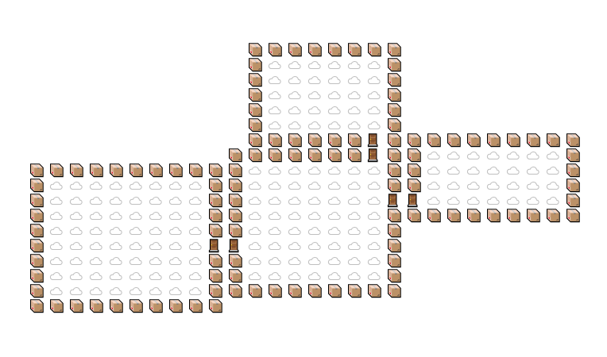
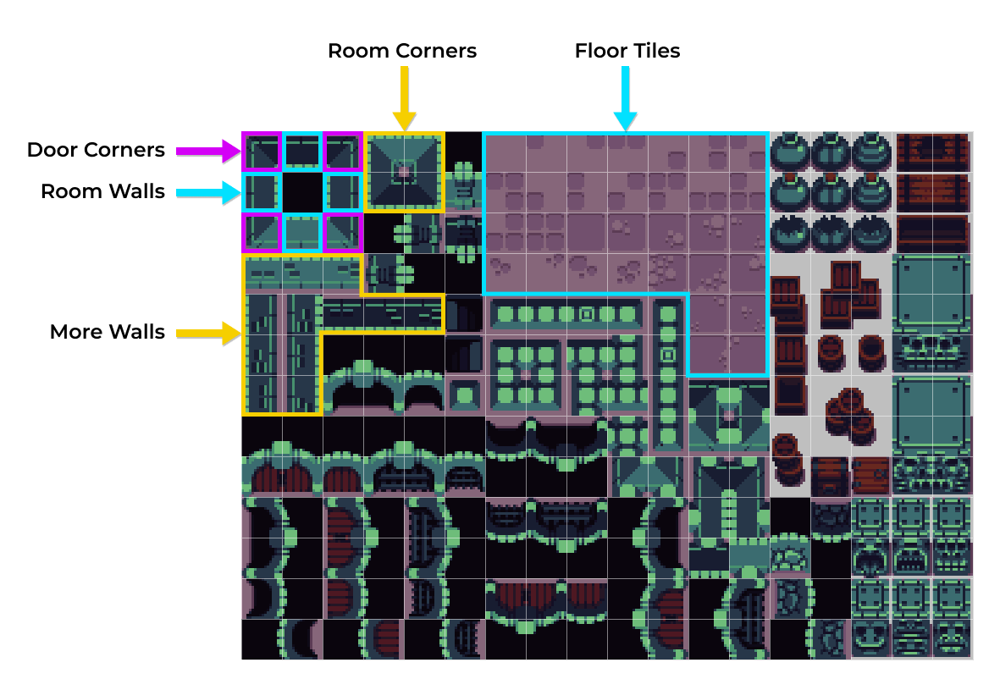
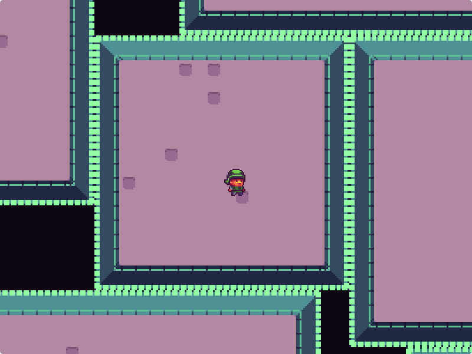

# Modular Game Worlds in Phaser 3 (Tilemaps #3) - Procedural Dungeon

Author: [Mike Hadley](https://www.mikewesthad.com/)

Reading this on GitHub? Check out the [medium post](https://medium.com/@michaelwesthadley/modular-game-worlds-in-phaser-3-tilemaps-3-procedural-dungeon-3bc19b841cd).

This is the third post in a series of blog posts about creating modular worlds with tilemaps in the [Phaser 3](http://phaser.io/) game engine. In this edition, we'll create an endless, procedurally-generated dungeon:


_↳ Tileset and Character by [Michele "Buch" Bucelli](https://opengameart.org/users/buch)_

If you haven't checked out the previous posts in the series, here are the links:

1.  [Static tilemaps & a Pokémon-style world](https://medium.com/@michaelwesthadley/modular-game-worlds-in-phaser-3-tilemaps-1-958fc7e6bbd6)
2.  [Dynamic tilemaps & puzzle-y platformer](https://medium.com/@michaelwesthadley/modular-game-worlds-in-phaser-3-tilemaps-2-dynamic-platformer-3d68e73d494a)

In the next post in the series, we'll investigate using [Matter.js](http://brm.io/matter-js/) with tilemaps.

Before we dive in, all the source code and assets that go along with this post can be found in [this repository](https://github.com/mikewesthad/phaser-3-tilemap-blog-posts/tree/master/examples/post-3).

## Intended Audience

This post will make the most sense if you have some experience with JavaScript (classes, arrow functions & modules), Phaser and the [Tiled](https://www.mapeditor.org/) map editor. If you don't, you might want to start at the beginning of the [series](https://medium.com/@michaelwesthadley/modular-game-worlds-in-phaser-3-tilemaps-1-958fc7e6bbd6), or continue reading and keep Google, the Phaser tutorial and the Phaser [examples](https://labs.phaser.io/) & [documentation](https://photonstorm.github.io/phaser3-docs/index.html) handy.

Alright, Let's get into it!

## Overview

This post builds on the idea of static vs dynamic tilemap layers that we talked about [last time](https://medium.com/@michaelwesthadley/modular-game-worlds-in-phaser-3-tilemaps-2-dynamic-platformer-3d68e73d494a). The code we're going to build in this post is based on one of my contributions to [Phaser Labs](https://labs.phaser.io/). It was definitely the example I had the most fun making, and it conveniently covers a lot of additional parts of the dynamic tilemap layer API that we haven't covered yet - from randomizing tiles to using per-tile transparency to create shadows.

We'll start by getting comfortable with a dungeon generator library using vanilla HTML & JS. From there, we'll start bringing in Phaser and progressively building out our endless dungeon world.

## A Dungeon

We're going to get a head start on generating worlds by using a dungeon generator library, [mikewesthad/dungeon](https://github.com/mikewesthad/dungeon). It's my updated fork of [nickgravelyn/dungeon](https://github.com/nickgravelyn/dungeon) that has a few new features, along with being published on npm. It's a pretty simple, brute force dungeon generator. You give it some configuration info, and it randomly builds a dungeon room-by-room starting at the center of the map.

You can load the library via a [CDN](https://www.jsdelivr.com/package/npm/@mikewesthad/dungeon), by downloading the script, or through npm ([install instructions](https://github.com/mikewesthad/dungeon#installation)). Once you've got the library loaded, you'll have a `Dungeon` class that you can use to construct a dungeon instance like this:

```js
const dungeon = new Dungeon({
  // The dungeon's grid size
  width: 40,
  height: 40,
  rooms: {
    // Random range for the width of a room (grid units)
    width: {
      min: 5,
      max: 10
    },
    // Random range for the height of a room (grid units)
    height: {
      min: 8,
      max: 20
    },
    // Cap the area of a room - e.g. this will prevent large rooms like 10 x 20
    maxArea: 150,
    // Max rooms to place
    maxRooms: 10
  }
});
```

<!-- https://gist.github.com/mikewesthad/42a8f2f9d8d95cb6f35d83f84fd6059a -->

And we can visualize the random dungeon by generating some HTML via `dungeon.drawToHtml` which converts the dungeon to a `<pre><table> ... </table></pre>` HTML element. We just need to specify which characters we want to use for each type of "tile" in the dungeon:

```js
const html = dungeon.drawToHtml({
  empty: " ",
  wall: "📦",
  floor: "☁️",
  door: "🚪"
});

// Append the element to an existing element on the page
document.getElementById("centered-container").appendChild(html);
```

<!-- https://gist.github.com/mikewesthad/91b1ef1b35f477b0fe560c3f0fba22e8 -->

And voilà, emoji-goodness:


Check out the example:

[](https://codesandbox.io/s/xorr812k3p?hidenavigation=1&module=%2Fjs%2Findex.js&moduleview=1)

<!-- Embed link for medium: https://codesandbox.io/s/xorr812k3p?hidenavigation=1&module=%2Fjs%2Findex.js&moduleview=1 -->

_↳ Check out the [CodeSandbox](https://codesandbox.io/s/xorr812k3p?hidenavigation=1&module=%2Fjs%2Findex.js&moduleview=1), [live example](https://www.mikewesthad.com/phaser-3-tilemap-blog-posts/post-3/01-dungeon-html) or the source code [here](https://github.com/mikewesthad/phaser-3-tilemap-blog-posts/blob/master/examples/post-3/01-dungeon-html)._

## Phaser & Dungeon

Now we can introduce Phaser and put a player inside of these random worlds. The [previous post](https://medium.com/@michaelwesthadley/modular-game-worlds-in-phaser-3-tilemaps-2-dynamic-platformer-3d68e73d494a) in this series introduced the idea of using modules to better structure our code. Since modules aren't common in the Phaser examples, I'll break down the structure again here to help ease the transition.

Remember, if you're following along and not using CodeSandbox, you can get access to modules in your code by using `<script src="./js/index.js" type="module"></script>` in your HTML (see [example](https://github.com/mikewesthad/phaser-3-tilemap-blog-posts/blob/master/examples/post-3/02-dungeon-simple-mapping)). You could, of course, also reach for Webpack, Parcel or any of the other JavaScript build tools. Check out [phaser3-project-template](https://github.com/photonstorm/phaser3-project-template) for a webpack starting template.

On to the first example. Our directory structure looks like this:



"index.js" is the entry point for our code. This file kicks off things off by creating the Phaser game with arcade physics enabled and loading our custom scene:

```js
import DungeonScene from "./dungeon-scene.js";

const config = {
  type: Phaser.AUTO,
  width: 800,
  height: 600,
  backgroundColor: "#000",
  parent: "game-container",
  pixelArt: true,
  scene: DungeonScene,
  physics: {
    default: "arcade",
    arcade: {
      gravity: { y: 0 }
    }
  }
};

const game = new Phaser.Game(config);
```

<!-- https://gist.github.com/mikewesthad/193ed96b8dc9ffe3a954f0561ede0ddc -->

"dungeon-scene.js" is a module that exports a single `class` called `DungeonScene`. It extends [`Phaser.Scene`](https://photonstorm.github.io/phaser3-docs/Phaser.Scene.html), which means it has access to a bunch of Phaser functionality via properties (e.g. `this.add` for accessing the game factory). The scene loads up some assets in `preload`, creates the dungeon and player in `create` and updates the player each frame inside of `update`.

Once we've created a `dungeon` like we did in the last example, we can set up a tilemap with a blank layer using [`createBlankDynamicLayer`](https://photonstorm.github.io/phaser3-docs/Phaser.Tilemaps.Tilemap.html#createBlankDynamicLayer__anchor):

```js
const dungeon = new Dungeon({
  width: 50,
  height: 50,
  rooms: {
    width: { min: 7, max: 15 },
    height: { min: 7, max: 15 },
    maxRooms: 12
  }
});

// Create a blank map
const map = this.make.tilemap({
  tileWidth: 48,
  tileHeight: 48,
  width: dungeon.width,
  height: dungeon.height
});

// Load up a tileset, in this case, the tileset has 1px margin & 2px padding (last two arguments)
const tileset = map.addTilesetImage("tiles", null, 48, 48, 1, 2);

// Create an empty layer and give it the name "Layer 1"
const layer = map.createBlankDynamicLayer("Layer 1", tileset);
```

<!-- https://gist.github.com/mikewesthad/a66d44f433a38ea5a86fd72cd61f3a3a -->

`Dungeon` comes with an easy way to get a 2D array of tiles via `dungeon.getMappedTiles`, and Phaser has an easy way to insert an array of tiles into a layer via [`putTilesAt`](https://photonstorm.github.io/phaser3-docs/Phaser.Tilemaps.DynamicTilemapLayer.html#putTilesAt__anchor):

```js
// Turn the dungeon into a 2D array of tiles where each of the four types of tiles is mapped to a
// tile index within our tileset. Note: using -1 for empty tiles means they won't render.
const mappedTiles = dungeon.getMappedTiles({ empty: -1, floor: 6, door: 6, wall: 20 });

// Drop a 2D array into the map at (0, 0)
layer.putTilesAt(mappedTiles, 0, 0);
```

<!-- https://gist.github.com/mikewesthad/54b3482ac8e97894b27a987892542cc7 -->

And if we put this all together with a player module based on the code from the first post in the series, we end up with:

[](https://codesandbox.io/s/52v0nz348p?hidenavigation=1&module=%2Fjs%2Findex.js&moduleview=1)

<!-- Embed link for medium: https://codesandbox.io/s/52v0nz348p?hidenavigation=1&module=%2Fjs%2Findex.js&moduleview=1 -->

_↳ Check out the [CodeSandbox](https://codesandbox.io/s/52v0nz348p?hidenavigation=1&module=%2Fjs%2Findex.js&moduleview=1), [live example](https://www.mikewesthad.com/phaser-3-tilemap-blog-posts/post-3/02-dungeon-simple-mapping) or the source code [here](https://github.com/mikewesthad/phaser-3-tilemap-blog-posts/blob/master/examples/post-3/02-dungeon-simple-mapping)._

## A Closer Look at the Dungeon Tileset

Here's the tileset that we're using:



_↳ Unextruded image, [dungeon tileset](https://opengameart.org/content/top-down-dungeon-tileset) by Michele "Buch" Bucelli (tileset artist) & Abram Connelly (tileset sponsor)_

And we want to use those tiles instead of our previously emoji-mapped dungeons, which looked like:



We'll need to choose which tiles to use for the floor, walls and doors. Because this tileset has perspective and directional lighting, we are also going to need to use different tiles for the corners and the north, west, south and east walls.

Here are the specific tiles that we'll be using to create our rooms:



Before jumping into code, I'll usually play around with the tileset in [Tiled](https://www.mapeditor.org/) to get a feel for the tiles and how they fit together to create a room. Having a good plan in place is essential. Here's a short timelapse of me planning out how two rooms intersect:


_↳ If you want to follow that process more closely, here's a slower [video version](https://vimeo.com/281170034/f62b5d0dfe)._

One important thing to note is that I'm using two layers here. We'll want at least two layers when we get to Phaser - one for the ground & walls and one for the chests/pots/etc. - so that we can use the tiles that have transparent backgrounds.


## Mapping Our World

Now that we've got a plan for how to use the tiles, we can get started with the mapping. By the end of this section, we'll have this setup:


We're going to abandon the `dungeon.getMappedTiles` approach in favor of using the `dungeon.rooms` property. `rooms` is an array of objects with information about each room. A `Room` instance has the following properties:

- `x`, `y` - location of top left of the room (in grid units)
- `width` & `height`
- `top`, `left`, `bottom`, `right`
- `centerX` & `centerY` - integer center position (rounded down for even sized rooms)

And one method:

- `getDoorLocations` - gets an array of door locations (`{x, y}` objects) in coordinates relative to the room's top left

With those in mind, we can start mapping out our rooms:

```js
export default class DungeonScene extends Phaser.Scene {
  // ... preload omitted for brevity

  create() {
    // Generate a random world with a few extra options:
    //  - Rooms should only have odd dimensions so that they have a center tile.
    //  - Doors should be at least 2 tiles away from corners, to leave enough room for the tiles
    //    that we're going to put on either side of the door opening.
    this.dungeon = new Dungeon({
      width: 50,
      height: 50,
      doorPadding: 2,
      rooms: {
        width: { min: 7, max: 15, onlyOdd: true },
        height: { min: 7, max: 15, onlyOdd: true }
      }
    });

    // Creating a blank tilemap with dimensions matching the dungeon
    const map = this.make.tilemap({
      tileWidth: 48,
      tileHeight: 48,
      width: this.dungeon.width,
      height: this.dungeon.height
    });
    const tileset = map.addTilesetImage("tiles", null, 48, 48, 1, 2); // 1px margin, 2px spacing
    this.groundLayer = map.createBlankDynamicLayer("Ground", tileset); // Wall & floor
    this.stuffLayer = map.createBlankDynamicLayer("Stuff", tileset); // Chest, stairs, etc.
  }
}
```

<!-- https://gist.github.com/mikewesthad/827bccb91f9bed20297d47c19c196256 -->

We're going to be using the dynamic layer's [`fill`](https://photonstorm.github.io/phaser3-docs/Phaser.Tilemaps.DynamicTilemapLayer.html#fill__anchor), [`putTileAt`](https://photonstorm.github.io/phaser3-docs/Phaser.Tilemaps.DynamicTilemapLayer.html#putTileAt__anchor), [`putTilesAt`](https://photonstorm.github.io/phaser3-docs/Phaser.Tilemaps.DynamicTilemapLayer.html#putTilesAt__anchor) and [`weightedRandomize`](https://photonstorm.github.io/phaser3-docs/Phaser.Tilemaps.DynamicTilemapLayer.html#weightedRandomize__anchor) methods to build out our map. Let's start with `fill` and `weightedRandomize` to make an initial pass at placing the floor and walls:

```js
export default class DungeonScene extends Phaser.Scene {
  create() {
    // ... previous dungeon and map generation code omitted for brevity

    // Set all tiles in the ground layer with blank tiles (purple-black tile)
    this.groundLayer.fill(20);

    // Use the array of rooms generated to place tiles in the map
    // Note: using an arrow function here so that "this" still refers to our scene
    this.dungeon.rooms.forEach(room => {
      // These room properties are all in grid units (not pixels units)
      const { x, y, width, height, left, right, top, bottom } = room;

      // Fill the room (minus the walls) with mostly clean floor tiles (90% of the time), but
      // occasionally place a dirty tile (10% of the time).
      this.groundLayer.weightedRandomize(x + 1, y + 1, width - 2, height - 2, [
        { index: 6, weight: 9 }, // 9/10 times, use index 6
        { index: [7, 8, 26], weight: 1 } // 1/10 times, randomly pick 7, 8 or 26
      ]);

      // Place the room corners tiles
      this.groundLayer.putTileAt(3, left, top);
      this.groundLayer.putTileAt(4, right, top);
      this.groundLayer.putTileAt(23, right, bottom);
      this.groundLayer.putTileAt(22, left, bottom);

      // Place the non-corner wall tiles using fill with x, y, width, height parameters
      this.groundLayer.fill(39, left + 1, top, width - 2, 1); // Top
      this.groundLayer.fill(1, left + 1, bottom, width - 2, 1); // Bottom
      this.groundLayer.fill(21, left, top + 1, 1, height - 2); // Left
      this.groundLayer.fill(19, right, top + 1, 1, height - 2); // Right
    });
  }
}
```

<!-- https://gist.github.com/mikewesthad/01165ec3438ad177d9572ad07af28dd2 -->

And we'll end up with a character trapped in a door-less world:



`fill` is straight forward. You can just pass in an index to fill the whole layer, or you can pass in `x`, `y`, `width` & `height` parameters to fill a specific region.

`weightedRandomize` might be new if you haven't used weighted probabilities. The first four parameters define the region we want to randomize (`x`, `y`, `width`, `height`). The last parameter describes which tiles to place and their probabilities. It's an array of objects that contains an index (or an array of indices) and a weight. The probability of any given index being used is: `(the index's weight) / (sum of all weights for all indices)`.

We've got something working, but the code is a bit hard to read. You have to mentally keep track of what the tile indices mean. Instead, let's create a `tile-mapping.js` module that does that for us:

```js
// Mapping with:
// - Single index for putTileAt
// - Array of weights for weightedRandomize
// - Array or 2D array for putTilesAt
const TILE_MAPPING = {
  WALL: {
    TOP_LEFT: 3,
    TOP_RIGHT: 4,
    BOTTOM_RIGHT: 23,
    BOTTOM_LEFT: 22,
    // Let's add some randomization to the walls while we are refactoring:
    TOP: [{ index: 39, weight: 4 }, { index: [57, 58, 59], weight: 1 }],
    LEFT: [{ index: 21, weight: 4 }, { index: [76, 95, 114], weight: 1 }],
    RIGHT: [{ index: 19, weight: 4 }, { index: [77, 96, 115], weight: 1 }],
    BOTTOM: [{ index: 1, weight: 4 }, { index: [78, 79, 80], weight: 1 }]
  },
  FLOOR: [{ index: 6, weight: 9 }, { index: [7, 8, 26], weight: 1 }],
  POT: [{ index: 13, weight: 1 }, { index: 32, weight: 1 }, { index: 51, weight: 1 }],
  DOOR: {
    TOP: [40, 6, 38],
    // prettier-ignore
    LEFT: [
      [40],
      [6],
      [2]
    ],
    BOTTOM: [2, 6, 0],
    // prettier-ignore
    RIGHT: [
      [38],
      [6],
      [0]
    ]
  },
  CHEST: 166,
  STAIRS: 81,
  // prettier-ignore
  TOWER: [
    [186],
    [205]
  ]
};

export default TILE_MAPPING;
```

<!-- https://gist.github.com/mikewesthad/9da84f82cf89f61148e07732ee9949c3 -->

Then back in our scene we can do something like the following:

```js
import TILES from "./tile-mapping.js";

export default class DungeonScene extends Phaser.Scene {
  create() {
    // ... code omitted for brevity

    this.groundLayer.fill(TILES.BLANK);
  }
}
```

<!-- https://gist.github.com/mikewesthad/ae04e549f786ddd54ace76bddfbec4ac -->

I'm starting to omit code so that we don't have massive repeated code snippets in the article. If you get lost, hop down to the bottom of this section and check out the code sandbox. Now, to finish off our mapping, let's add in some doors:

```js
export default class DungeonScene extends Phaser.Scene {
  create() {
    // ... dungeon and map generation code omitted

    this.dungeon.rooms.forEach(room => {
      // These room properties are all in grid units (not pixels units)
      const { x, y, width, height, left, right, top, bottom } = room;

      // ... room tile mapping code omitted

      // Dungeons have rooms that are connected with doors. Each door has an x & y relative to the
      // room's location. Each direction has a different door to tile mapping.
      var doors = room.getDoorLocations(); // → Returns an array objects like this {x, y}
      for (var i = 0; i < doors.length; i++) {
        if (doors[i].y === 0) {
          this.groundLayer.putTilesAt(TILES.DOOR.TOP, x + doors[i].x - 1, y + doors[i].y);
        } else if (doors[i].y === room.height - 1) {
          this.groundLayer.putTilesAt(TILES.DOOR.BOTTOM, x + doors[i].x - 1, y + doors[i].y);
        } else if (doors[i].x === 0) {
          this.groundLayer.putTilesAt(TILES.DOOR.LEFT, x + doors[i].x, y + doors[i].y - 1);
        } else if (doors[i].x === room.width - 1) {
          this.groundLayer.putTilesAt(TILES.DOOR.RIGHT, x + doors[i].x, y + doors[i].y - 1);
        }
      }
    });
  }
}
```

<!-- https://gist.github.com/mikewesthad/c70ce241d5e793845277f2d31c0ecc9d -->

Now we can add back in the player collision logic, similar to the last example:

```js
// Not exactly correct for the tileset since there are more possible floor tiles, but this will
// do for the example.
this.groundLayer.setCollisionByExclusion([-1, 6, 7, 8, 26]);

this.player = new Player(this, map.widthInPixels / 2, map.heightInPixels / 2);

// Watch the player and layer for collisions, for the duration of the scene:
this.physics.add.collider(this.player.sprite, this.groundLayer);
```

<!-- https://gist.github.com/mikewesthad/c5ddd9db3922a2c502a4adf25c5102a6 -->

And we end up with:

[](https://codesandbox.io/s/l54pq7lq7z?hidenavigation=1&module=%2Fjs%2Findex.js&moduleview=1)

<!-- Embed link for medium: https://codesandbox.io/s/l54pq7lq7z?hidenavigation=1&module=%2Fjs%2Findex.js&moduleview=1 -->

_↳ Check out the [CodeSandbox](https://codesandbox.io/s/l54pq7lq7z?hidenavigation=1&module=%2Fjs%2Findex.js&moduleview=1), [live example](https://www.mikewesthad.com/phaser-3-tilemap-blog-posts/post-3/03-dungeon-better-mapping) or the source code [here](https://github.com/mikewesthad/phaser-3-tilemap-blog-posts/blob/master/examples/post-3/03-dungeon-better-mapping)._

## Stuff & Visibility

This is starting to feel more complete, so let's kick it up by randomly place some stuff in the rooms and then adding a visibility algorithm to create a fog of war effect:


For adding stuff, we're going to want another layer:

```js
this.stuffLayer = map.createBlankDynamicLayer("Stuff", tileset);
this.stuffLayer.fill(TILES.BLANK);
```

<!-- https://gist.github.com/mikewesthad/c9cb978bf8b41e690707468ba6f3e1df -->

And then we can loop over the rooms again to place some stuff. We're going to skip placing anything in the first room. We're also going to designate a randomly selected room as the "goal" room, which will have a staircase that descends down to a new dungeon.

```js
this.dungeon.rooms.forEach(room => {
  // tile mapping code from last section omitted
});

// Separate out the rooms into:
//  - The starting room (index = 0)
//  - A random room to be designated as the end room (with stairs and nothing else)
//  - An array of 90% of the remaining rooms, for placing random stuff (leaving 10% empty)
const rooms = this.dungeon.rooms.slice();
const startRoom = rooms.shift();
const endRoom = Phaser.Utils.Array.RemoveRandomElement(rooms);
const otherRooms = Phaser.Utils.Array.Shuffle(rooms).slice(0, rooms.length * 0.9);

// Place the stairs
this.stuffLayer.putTileAt(TILES.STAIRS, endRoom.centerX, endRoom.centerY);

// Place stuff in the 90% "otherRooms"
otherRooms.forEach(room => {
  var rand = Math.random();
  if (rand <= 0.25) {
    // 25% chance of chest
    this.stuffLayer.putTileAt(TILES.CHEST, room.centerX, room.centerY);
  } else if (rand <= 0.5) {
    // 50% chance of a pot anywhere in the room... except don't block a door!
    const x = Phaser.Math.Between(room.left + 2, room.right - 2);
    const y = Phaser.Math.Between(room.top + 2, room.bottom - 2);
    this.stuffLayer.weightedRandomize(x, y, 1, 1, TILES.POT);
  } else {
    // 25% of either 2 or 4 towers, depending on the room size
    if (room.height >= 9) {
      this.stuffLayer.putTilesAt(TILES.TOWER, room.centerX - 1, room.centerY + 1);
      this.stuffLayer.putTilesAt(TILES.TOWER, room.centerX + 1, room.centerY + 1);
      this.stuffLayer.putTilesAt(TILES.TOWER, room.centerX - 1, room.centerY - 2);
      this.stuffLayer.putTilesAt(TILES.TOWER, room.centerX + 1, room.centerY - 2);
    } else {
      this.stuffLayer.putTilesAt(TILES.TOWER, room.centerX - 1, room.centerY - 1);
      this.stuffLayer.putTilesAt(TILES.TOWER, room.centerX + 1, room.centerY - 1);
    }
  }
});
```

<!-- https://gist.github.com/mikewesthad/e1e4fbfd49b5fc1f743b8a0f44fc540f -->

Then once you activate collision on the new `stuffLayer`, you'll end up with:


And what would a rougelike dungeon be like without some sort of lighting effect? We're going to go with something easy to show off the dynamic layer API, but you could implement something fun like a [ray casting approach](https://www.redblobgames.com/articles/visibility/) on your own.

Unlike static map layers, dynamic layers can have per tile effects like tint and alpha. We're going to take advantage of that by create a third tilemap layer which will just have blank, black tiles everywhere. They will start out completely opaque, but when a player enters a room, we'll make the tiles "above" the room transparent so that the player can see. When they leave a room, we'll "fog" the old room by making the black overlay semi-opaque.

Inside of our scene's `create`, we'll start by creating a new tilemap layer filled with black tiles and handing it off to a yet-to-be-created new module:

```js
const shadowLayer = map.createBlankDynamicLayer("Shadow", tileset).fill(TILES.BLANK);
this.tilemapVisibility = new TilemapVisibility(shadowLayer);
```

<!-- https://gist.github.com/mikewesthad/7dc582ff806602ae9e409097e8980d83 -->

Inside of "tilemap-visibility.js", we'll create a new class that keeps track of the currently active room and dims/brightens rooms as needed:

```js
export default class TilemapVisibility {
  constructor(shadowLayer) {
    this.shadowLayer = shadowLayer;
    this.activeRoom = null;
  }

  setActiveRoom(room) {
    // We only need to update the tiles if the active room has changed
    if (room !== this.activeRoom) {
      this.setRoomAlpha(room, 0); // Make the new room visible
      if (this.activeRoom) this.setRoomAlpha(this.activeRoom, 0.5); // Dim the old room
      this.activeRoom = room;
    }
  }

  // Helper to set the alpha on all tiles within a room
  setRoomAlpha(room, alpha) {
    this.shadowLayer.forEachTile(
      t => (t.alpha = alpha),
      this,
      room.x,
      room.y,
      room.width,
      room.height
    );
  }
}
```

<!-- https://gist.github.com/mikewesthad/60cd2592c77dbc0183979d25fdf9e320 -->

And then lastly, inside of our scene's `update` we just need to update the active room:

```js
update(time, delta) {
  this.player.update();

  // Find the player's room using another helper method from the dungeon that converts from
  // dungeon XY (in grid units) to the corresponding room instance
  const playerTileX = this.groundLayer.worldToTileX(this.player.sprite.x);
  const playerTileY = this.groundLayer.worldToTileY(this.player.sprite.y);
  const playerRoom = this.dungeon.getRoomAt(playerTileX, playerTileY);

  this.tilemapVisibility.setActiveRoom(playerRoom);
}
```

<!-- https://gist.github.com/mikewesthad/9c230024983308c51274b47ed6a57c1e -->

Whew, and we finally end up with something like this:

[](https://codesandbox.io/s/3r0nvw2z2p?hidenavigation=1&module=%2Fjs%2Findex.js&moduleview=1)

<!-- Embed link for medium: https://codesandbox.io/s/3r0nvw2z2p?hidenavigation=1&module=%2Fjs%2Findex.js&moduleview=1 -->

_↳ Check out the [CodeSandbox](https://codesandbox.io/s/3r0nvw2z2p?hidenavigation=1&module=%2Fjs%2Findex.js&moduleview=1), [live example](https://www.mikewesthad.com/phaser-3-tilemap-blog-posts/post-3/04-dungeon-final) or the source code [here](https://github.com/mikewesthad/phaser-3-tilemap-blog-posts/blob/master/examples/post-3/04-dungeon-final)._

## Extras Bits: Descending the Stairs

In that last code example, I added a couple extra bits. Using tile index callbacks, we can detect when the player has reached the stairs and restart the scene to let the player enter a new dungeon. [`setTileIndexCallback`](https://photonstorm.github.io/phaser3-docs/Phaser.Tilemaps.DynamicTilemapLayer.html#setTileIndexCallback__anchor) will set up a callback to run whenever an arcade body intersects a tile with the given index. It's useful in a situation like our game where we only have one moving body (the player). The relevant code inside of `create` looks like this:

```js
this.stuffLayer.setTileIndexCallback(TILES.STAIRS, () => {
  this.stuffLayer.setTileIndexCallback(TILES.STAIRS, null);
  this.hasPlayerReachedStairs = true;
  this.player.freeze();
  const cam = this.cameras.main;
  cam.fade(250, 0, 0, 0);
  cam.once("camerafadeoutcomplete", () => {
    this.player.destroy();
    this.scene.restart();
  });
});
```

<!-- https://gist.github.com/mikewesthad/9896e69057ed216ddc1734a2d2a5fcd7  -->

I also added a `level` property to the scene so that we can tell the player what level they are on:

```js
export default class DungeonScene extends Phaser.Scene {
  constructor() {
    super();

    // Constructor is called once when the scene is created for the first time. When the scene is
    // stopped/started (or restarted), the constructor will NOT be called again.
    this.level = 0;
  }

  create() {
    this.level++;

    // ... code omitted

    // Help text that has a "fixed" position on the screen
    this.add
      .text(16, 16, `Find the stairs. Go deeper.\nCurrent level: ${this.level}`, {
        font: "18px monospace",
        fill: "#000000",
        padding: { x: 20, y: 10 },
        backgroundColor: "#ffffff"
      })
      .setScrollFactor(0);
  }
}
```

<!-- https://gist.github.com/mikewesthad/bcc73d47285e39921e1a2bae04f9dd70 -->

## Up Next

Stay tuned. Next up, we'll investigate using a more advanced physics engine - [Matter.js](http://brm.io/matter-js/) - to create a wall-jumping platformer.

<!-- TODO insert GIF of next post when it's ready -->

Thanks for reading, and if there's something you'd like to see in future posts, let me know!

## About Me

I’m a creative developer & educator. I wrote the Tilemap API for Phaser 3 and created a ton of guided examples, but I wanted to collect all of that information into a more guided and digestible format so that people can more easily jump into Phaser 3. You can see more of my work and get in touch [here](https://www.mikewesthad.com/).
