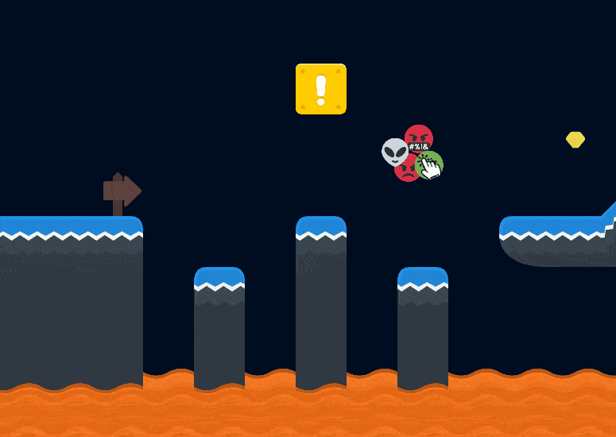
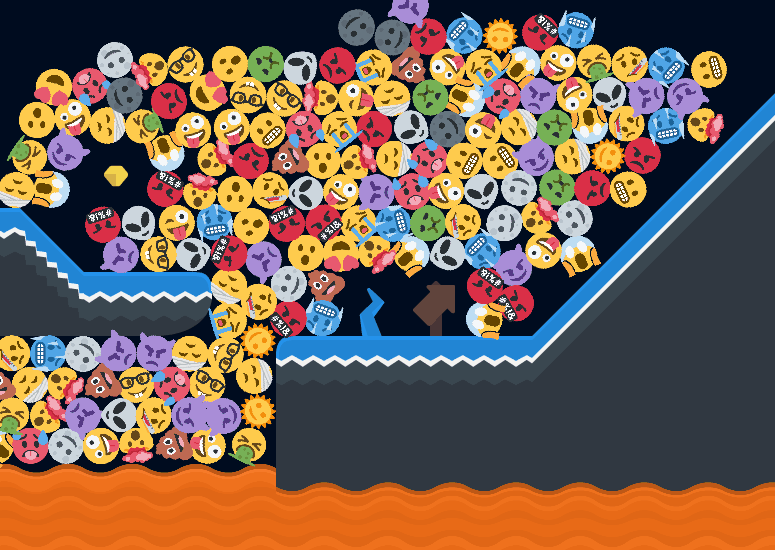
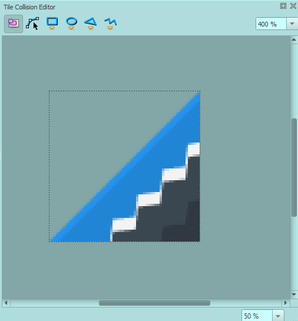
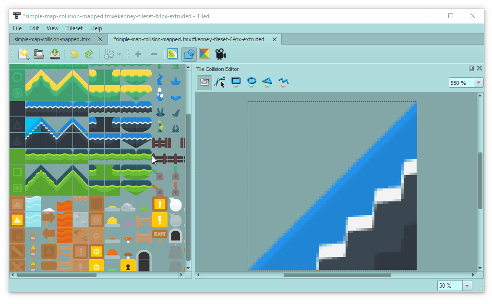
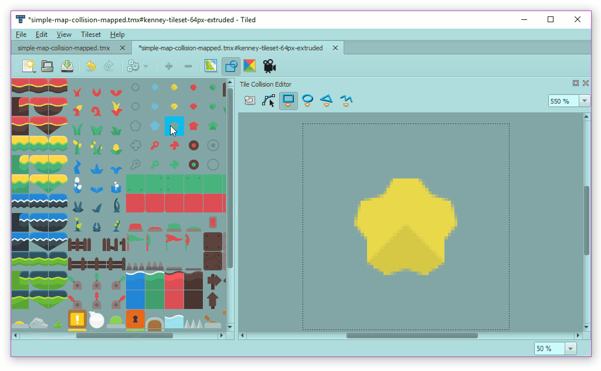
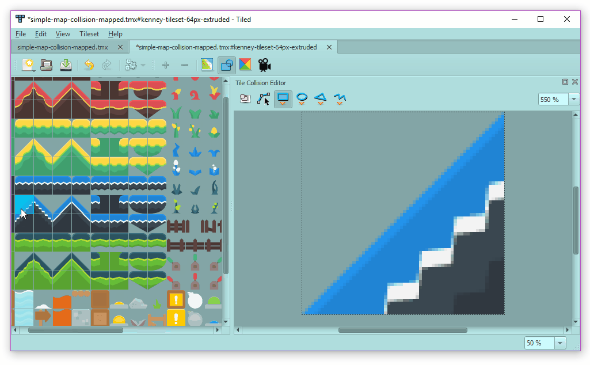
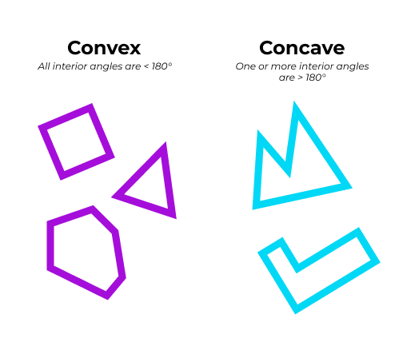
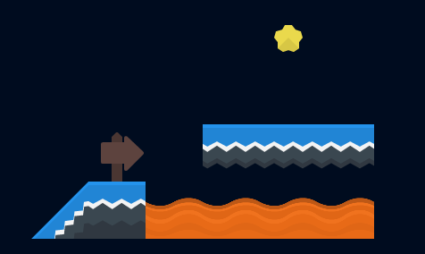
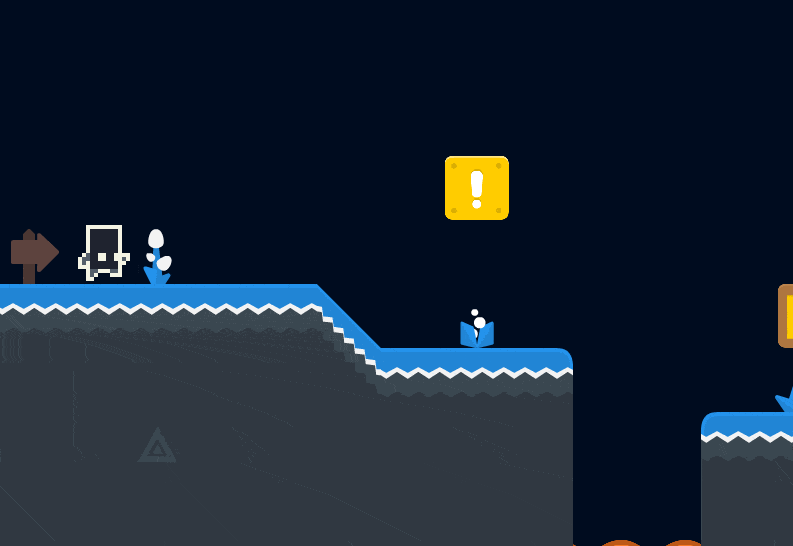

# Modular Game Worlds in Phaser 3 (Tilemaps #4) - Meet Matter.js

Author: [Mike Hadley](https://www.mikewesthad.com/)

Reading this on GitHub? Check out the [medium post](https://medium.com/@michaelwesthadley/modular-game-worlds-in-phaser-3-tilemaps-4-meet-matter-js-abf4dfa65ca1).

This is the fourth post in a series of blog posts about creating modular worlds with tilemaps in the [Phaser 3](http://phaser.io/) game engine. In this edition, we'll get acquainted with Matter.js, so that we can set up a world with "realistic" physics:


_↳ Dropping [Twemoji](https://github.com/twitter/twemoji)_

This will set us up for the next post where we'll ditch the emoji and add a player jumping around this world.

If you haven't checked out the previous posts in the series, here are the links:

1.  [Static tilemaps & a Pokémon-style world](https://medium.com/@michaelwesthadley/modular-game-worlds-in-phaser-3-tilemaps-1-958fc7e6bbd6)
2.  [Dynamic tilemaps & puzzle-y platformer](https://medium.com/@michaelwesthadley/modular-game-worlds-in-phaser-3-tilemaps-2-dynamic-platformer-3d68e73d494a)
3.  [Dynamic tilemaps & Procedural Dungeons](https://medium.com/@michaelwesthadley/modular-game-worlds-in-phaser-3-tilemaps-3-procedural-dungeon-3bc19b841cd)

Before we dive in, all the source code and assets that go along with this post can be found in [this repository](https://github.com/mikewesthad/phaser-3-tilemap-blog-posts/tree/master/examples/post-4).

A quick note for following along with Tiled: A recent release of Tiled (version 1.2) changed the map export format in a way that breaks Phaser's map importing. Phaser 3.14.0 - the version that supports Tiled 1.2 - is also broken when it comes to getting collision info... I'm using Tiled 1.1 & Phaser 3.11 here. So TLDR, use Tiled 1.1 + Phaser 3.11, or use a version of Phaser >= 3.14.0 (whenever it drops, likely on 10/15/18).

## Intended Audience

This post will make the most sense if you have some experience with JavaScript (classes, arrow functions & modules), Phaser and the [Tiled](https://www.mapeditor.org/) map editor. If you don't, you might want to start at the beginning of the [series](https://medium.com/@michaelwesthadley/modular-game-worlds-in-phaser-3-tilemaps-1-958fc7e6bbd6), or continue reading and keep Google, the Phaser tutorial and the Phaser [examples](https://labs.phaser.io/) & [documentation](https://photonstorm.github.io/phaser3-docs/index.html) handy.

Alright, Let's get into it!

## Overview

As I was writing up this post, I realized that there were just too many new concepts to pack into one post, so I'm splitting this into two posts. This one will introduce the Matter physics engine by itself, and then we'll bring in Phaser, tilemaps and mapping tile bodies in Tiled. In the second post, we'll dive into Matter's collision logic and build a platformer.

A quick sidebar: this whole tutorial series is tilemap-centric, so of course we are going to use tilemaps here. That said, the game/art/tool/etc. that you may want to create might not need a tilemap, e.g. this [pinball game](https://codepen.io/lonekorean/pen/KXLrVX) made with Matter. Don't feel constrained to tilemaps just because we are using them here! You'll learn the basics of Matter along the way here, so you'll still get something out of following along even if you don't use tilemaps.

## Introduction to Matter

[Matter](http://brm.io/matter-js/) is another JavaScript 2D physics engine. Whereas arcade physics (AP) in Phaser aims to be fast and simple (mainly just axis-aligned bounding boxes and circles), Matter is a more realistic physics simulation engine - complex body shapes, mass, density, constraints, etc.

AP is perfect if you have a game where you can get by with boxes & circles, but if you want to do something like create physics puzzles in your world (Angry Birds, Crayon Physics, etc.), Matter is the way to go. For example, here's the slingshot demo from the Matter site (click and drag the blue shape on the left):

https://codepen.io/liabru/pen/yGbFt

_↳ Demo by liabru, creator of Matter.js_

You'll definitely want to play around with the [other demos](http://brm.io/matter-js/demo/) on the Matter site to get a feel for what Matter can do. You'll also want to keep the [Matter docs](http://brm.io/matter-js/docs/) handy.

## First Steps with Matter

Phaser's implementation is a thin wrapper around the underlying Matter library, so if we want to use Matter in Phaser, we should start with learning Matter by itself. We'll create a simple setup where you can drop random shapes into a world:


Matter is structured around modules that contain factory functions for creating objects and functions that can manipulate those objects. For example, the `Body` module is about creating & manipulating [rigidbodies](https://www.quora.com/What-is-a-rigid-body), so it has the `Body.create(...)` factory which will create a fresh body object for us, and `Body.applyForce(...)` which will apply a force to the given body object. So the first step we'll want to take is to alias a few of the modules:

```js
// If you are following along in codesandbox, or using modules locally:
import { Engine, Render, World, Bodies, Body } from Matter;

// Or, if you are using Matter loaded via a script (like in the GitHub repository associated with
// this post):
const { Engine, Render, World, Bodies, Body } = Matter;
```

<!-- https://gist.github.com/mikewesthad/3c00d06d5dca1a71c33abab44c126741 -->

Next, we'll want to create an engine and a renderer. Matter comes packaged with a simple canvas renderer, so we'll take advantage of that before moving into using Phaser:

```js
const engine = Engine.create();
const render = Render.create({
  element: document.getElementById("game-container"),
  engine: engine,
  options: {
    width: 800,
    height: 600,
    wireframes: false, // Draw the shapes as solid colors
    background: "#f4f4f8"
  }
});
```

<!-- https://gist.github.com/mikewesthad/2fb54459fd52b8950919d99afcff642d -->

Now that we've got a physics simulation engine and renderer, we can add some bodies to the world:

```js
// Create a rectangle centered at the top of the screen, (400, 0), with 120px width and 80px height
const rectangle = Bodies.rectangle(400, 0, 120, 80, { restitution: 0.25, angle: Math.PI / 4 });

// Create an immovable rectangle at the bottom of the screen that will act as the floor
const floor = Bodies.rectangle(400, 575, 800, 50, { isStatic: true });

// Add the newly minted bodies to our physics simulation
World.add(engine.world, [rectangle, floor]);

// Kick off the simulation and the render loops
Engine.run(engine);
Render.run(render);
```

<!-- https://gist.github.com/mikewesthad/884c98937e4817999a65d56689b44fc7 -->


Let's break that down. `Bodies.rectangle(400, 0, 120, 80, { restitution: 0.25, angle: Math.PI / 4 })` will create a new, rectangular physics body. It's positioned using the center of the body as the origin. The last parameter is an object that you can pass in to override the default [body properties](http://brm.io/matter-js/docs/classes/Body.html#properties). We've passed in an `angle` of Math.PI / 4 radians (45 degrees), which will override the default body rotation, 0 radians. We're passing in a `restitution` property here which specifies the elasticity of the body. By default it's 0 (inelastic), so we're overriding it to create a slightly bouncy rectangle. Other useful properties include: `friction`, `frictionAir`, `frictionStatic` and `density`.

The `floor` body can't be moved or rotated because we've flagged it as a static body using `isStatic`. So our rectangle will bounce off the floor without the floor moving.

We can introduce a few new body types (polygons & circles) and fill out our world:

```js
const DEGREES_TO_RADIANS = Math.PI / 180; // Helper to convert from degrees to radians

// Create some simple physics bodies, horizontally centered & above the top edge of the canvas
const rectangle = Bodies.rectangle(400, -300, 120, 80, { friction: 1, restitution: 0.25 });
const circle = Bodies.circle(400, -150, 50, { friction: 0, restitution: 1 });
// Polygon parameters: x, y, number of sides, radius of the shape, body options. A three-sided
// polygon will give us a triangle.
const triangle = Bodies.polygon(400, 0, 3, 50, { friction: 0, restitution: 0.5 });

// Create an immovable rectangle at the bottom of the screen that will act as the floor
const floor = Bodies.rectangle(400, 575, 800, 50, { isStatic: true });

// Create some vertical walls that are positioned just off screen.
const leftWall = Bodies.rectangle(-25, 400, 50, 800, { isStatic: true, friction: 0 });
const rightWall = Bodies.rectangle(825, 400, 50, 800, { isStatic: true, friction: 0 });

// Create some bouncy, static obstacles in the world for our bodies to ricochet off of
const obstacle1 = Bodies.circle(150, 200, 85, { isStatic: true, friction: 0, restitution: 1 });
const obstacle2 = Bodies.polygon(400, 400, 3, 75, {
  isStatic: true,
  angle: 90 * DEGREES_TO_RADIANS,
  friction: 0,
  restitution: 1
});
const obstacle3 = Bodies.circle(650, 200, 85, { isStatic: true, friction: 0, restitution: 1 });

World.add(engine.world, [
  rectangle,
  triangle,
  circle,
  floor,
  leftWall,
  rightWall,
  obstacle1,
  obstacle2,
  obstacle3
]);
```

<!-- https://gist.github.com/mikewesthad/0bb17e4840010d01b8570f9d26eb39ef -->


_↳ Since the rectangle has the highest friction and lowest restitution, it's the least bouncy and slippery of the shapes._

We can also create compound bodies, bodies which have multiple parts that are linked together. The parts will move together as one object:

```js
// Create a cross-shaped compound body that is composed of two rectangle bodies joined together
const verticalPart = Bodies.rectangle(400, 150, 100, 50);
const horizontalPart = Bodies.rectangle(400, 150, 50, 100);
const cross = Body.create({
  parts: [verticalPart, horizontalPart],
  friction: 0,
  restitution: 1
});

// Don't forget to add it to World.add(...)
```

<!-- https://gist.github.com/mikewesthad/19cba813037bf9d5f583951d5c61af98 -->


The last piece we'll add is the ability to drop new polygons any time you click on the canvas:

```js
// A few random helper functions
const randomInRange = (min, max) => Math.random() * (max - min) + min;
const randomIntInRange = (min, max) => Math.floor(Math.random() * (max - min + 1) + min);

// Listen for mouse presses on the canvas and add a bunch of new bodies to the world
document.querySelector("canvas").addEventListener("mousedown", () => {
  for (let i = 0; i < 5; i++) {
    const x = randomInRange(50, 750);
    const y = randomInRange(0, 50);
    const radius = randomInRange(25, 50);
    const sides = randomIntInRange(3, 6);
    const body = Bodies.polygon(x, y, sides, radius, {
      friction: 0,
      restitution: 0.5
    });
    World.add(engine.world, body);
  }
});
```

And putting it all together:

[](https://codesandbox.io/s/mq87yklq0p?hidenavigation=1&module=%2Fjs%2Findex.js&moduleview=1)

<!-- Embed link for medium: https://codesandbox.io/s/mq87yklq0p?hidenavigation=1&module=%2Fjs%2Findex.js&moduleview=1 -->

_↳ Check out the [CodeSandbox](https://codesandbox.io/s/mq87yklq0p?hidenavigation=1&module=%2Fjs%2Findex.js), [live example](https://www.mikewesthad.com/phaser-3-tilemap-blog-posts/post-4/01-matter) or the source code [here](https://github.com/mikewesthad/phaser-3-tilemap-blog-posts/blob/master/examples/post-4/01-matter)._

Now that we've got the Matter fundamentals, we can turn our attention to working with Matter & Phaser together. Check out this [tutorial series](https://code.tutsplus.com/series/getting-started-with-matterjs--cms-1186) by Monty Shokeen if you want to dive deeper into Matter by itself.

## Matter and Phaser

We'll create something similar to the last example, except we'll use a tilemap to define the world and we'll drop some emojis (because why not):



Using the same structure as the last tutorial in this series, we'll create an `index.js` file that creates our game and loads a custom scene:

```js
import MainScene from "./main-scene.js";

const config = {
  type: Phaser.AUTO,
  width: 800,
  height: 600,
  backgroundColor: "#000c1f",
  parent: "game-container",
  pixelArt: true,

  // Load our yet-to-be-created custom scene
  scene: MainScene,

  // Load up Matter and optionally configure it
  physics: {
    default: "matter",
    matter: {
      gravity: { y: 1 } // This is the default value, so we could omit this
    }
  }
};

const game = new Phaser.Game(config);
```

<!-- https://gist.github.com/mikewesthad/bbeec30c08253b0a634a8a0db23d5041 -->

Let's start by creating `MainScene` which loads up the tilemap and enables physics:

```js
export default class MainScene extends Phaser.Scene {
  preload() {
    this.load.tilemapTiledJSON("map", "../assets/tilemaps/simple-map.json");
    this.load.image(
      "kenney-tileset-64px-extruded",
      "../assets/tilesets/kenney-tileset-64px-extruded.png"
    );

    // An atlas is a way to pack multiple images together into one texture. For more info see:
    //  https://labs.phaser.io/view.html?src=src/animation/texture%20atlas%20animation.js
    this.load.atlas("emoji", "../assets/atlases/emoji.png", "../assets/atlases/emoji.json");
  }

  create() {
    // Create the 2-layer map
    const map = this.make.tilemap({ key: "map" });
    const tileset = map.addTilesetImage("kenney-tileset-64px-extruded");
    const groundLayer = map.createDynamicLayer("Ground", tileset, 0, 0);
    const lavaLayer = map.createDynamicLayer("Lava", tileset, 0, 0);

    // Set colliding tiles before converting the layer to Matter bodies - same as we've done before
    // with AP. See post #1 for more on setCollisionByProperty.
    groundLayer.setCollisionByProperty({ collides: true });
    lavaLayer.setCollisionByProperty({ collides: true });

    // Get the layers registered with Matter. Any colliding tiles will be given a Matter body. We
    // haven't mapped out custom collision shapes in Tiled so each colliding tile will get a default
    // rectangle body (similar to AP).
    this.matter.world.convertTilemapLayer(groundLayer);
    this.matter.world.convertTilemapLayer(lavaLayer);

    // Visualize all the matter bodies in the world. Note: this will be slow so go ahead and comment
    // it out after you've seen what the bodies look like.
    this.matter.world.createDebugGraphic();
}
```

<!-- https://gist.github.com/mikewesthad/896b44d4ac2bc035a7d8912e7ed3f394 -->

If we look closely, we can see that all the new bodies are rectangles. We'll get into giving the tiles custom bodies that match their graphics in the next section.


Now, we can drop a couple emojis with circle bodies into our scene using [`this.matter.add.image`](https://photonstorm.github.io/phaser3-docs/Phaser.Physics.Matter.Factory.html#image__anchor). Like with AP, we can create physics enabled images and [sprites](https://photonstorm.github.io/phaser3-docs/Phaser.Physics.Matter.Factory.html#sprite__anchor) using the `this.matter.add` [factory methods](https://photonstorm.github.io/phaser3-docs/Phaser.Physics.Matter.Factory.html). The factory also has methods for creating native Matter bodies and constraints (without any graphics), e.g. `this.matter.add.rectangle`.

```js
// Drop a couple matter-enabled emoji images into the world. (Note, the frame names come from
// twemoji - they are the unicode values of the emoji.)

// Create a physics-enabled image
const image1 = this.matter.add.image(275, 100, "emoji", "1f92c");
// Change it's body to a circle and configure its body parameters
image1.setCircle(image1.width / 2, { restitution: 1, friction: 0.25 });
image1.setScale(0.5);

const image2 = this.matter.add.image(300, 75, "emoji", "1f60d");
image2.setCircle(image2.width / 2, { restitution: 1, friction: 0.25 });
image2.setScale(0.5);

// We can also pass in our Matter body options directly into to this.matter.add.image, along with
// a Phaser "shape" property for controlling the type & size of the body
const image3 = this.matter.add
  .image(325, 100, "emoji", "1f4a9", { restitution: 1, friction: 0, shape: "circle" })
  .setScale(0.5);
```

<!-- https://gist.github.com/mikewesthad/7ff042cfea7de8318c24e53720b3c6f7 -->

These image variables are now instances of [`Phaser.Physics.Matter.Image`](https://photonstorm.github.io/phaser3-docs/Phaser.Physics.Matter.Image.html). They have the properties and methods of a normal Phaser image, but with added methods and properties for manipulating the underlying Matter body. There's a `body` property which gives you access to the native Matter body, and methods like [`setCircle`](https://photonstorm.github.io/phaser3-docs/Phaser.Physics.Matter.Image.html#setCircle__anchor), [`setRectangle`](https://photonstorm.github.io/phaser3-docs/Phaser.Physics.Matter.Image.html#setRectangle__anchor), [`setBody`](https://photonstorm.github.io/phaser3-docs/Phaser.Physics.Matter.Image.html#setBody__anchor), [`setExistingBody`](https://photonstorm.github.io/phaser3-docs/Phaser.Physics.Matter.Image.html#setExistingBody__anchor), etc. for replacing the image's current body. The same idea applies to [`Phaser.Phyiscs.Matter.Sprite`](https://photonstorm.github.io/phaser3-docs/Phaser.Physics.Matter.Sprite.html).

Like the Matter example from the previous section, we can add in some emojis every time the left mouse button is pressed by adding the following to our `create` method:

```js
// To randomize which emoji we'll use, we'll grab all the atlas's frame names
const frameNames = Object.keys(this.cache.json.get("emoji").frames);

this.input.on("pointerdown", () => {
  const worldPoint = this.input.activePointer.positionToCamera(this.cameras.main);
  for (let i = 0; i < 4; i++) {
    const x = worldPoint.x + Phaser.Math.RND.integerInRange(-10, 10);
    const y = worldPoint.y + Phaser.Math.RND.integerInRange(-10, 10);
    const frame = Phaser.Utils.Array.GetRandom(frameNames);
    this.matter.add
      .image(x, y, "emoji", frame, { restitution: 1, friction: 0, shape: "circle" })
      .setScale(0.5);
  }
});

// Our canvas is now "clickable" so let's update the cursor to a custom pointer
this.input.setDefaultCursor("url(../assets/cursors/pointer.cur), pointer");
```

<!-- https://gist.github.com/mikewesthad/b99e14efa0c4b20f4cfa5c637b7e6033 -->

And all together:

[](https://codesandbox.io/s/mq6rr2jn5p?hidenavigation=1&module=%2Fjs%2Findex.js&moduleview=1)

<!-- Embed link for medium: https://codesandbox.io/s/mq6rr2jn5p?hidenavigation=1&module=%2Fjs%2Findex.js&moduleview=1 -->

_↳ Check out the [CodeSandbox](https://codesandbox.io/s/mq6rr2jn5p?hidenavigation=1&module=%2Fjs%2Findex.js&moduleview=1), [live example](https://www.mikewesthad.com/phaser-3-tilemap-blog-posts/post-4/02-matter-and-phaser) or the source code [here](https://github.com/mikewesthad/phaser-3-tilemap-blog-posts/blob/master/examples/post-4/02-matter-and-phaser)._

## Mapping Collisions Shapes

We've got our tiles integrated with Matter, but we've got a problem. Our bodies are all rectangles, but our tiles aren't all rectangles:



We're not really taking advantage of Matter's different body shapes... yet. In Tiled, we can map our collision shapes using the built-in [collision editor](http://docs.mapeditor.org/en/stable/manual/editing-tilesets/). Phaser will automatically parse out circles, rectangles, polygons and compound shapes when we use `this.matter.world.convertTilemapLayer(...)`.

To map out the shapes in Tiled, we need to:

1.  Go to the tileset properties window and open the collision editor.
2.  Click on a tile and map out its body. Repeat for all the tiles that need custom bodies.
3.  Save the tileset & re-export the tilemap.

Tiled's user interface can be a little confusing, so here's how to open the collision editor:


Once we've got a tile selected, we'll have this window to map out the colliding shapes over the tile:



_↳ From left to right in the toolbar, the tools are: select object, edit polygon points, create rectangle, create ellipse, create polygon and create polyline. We'll use all of them except for the polyline._

Let's take a look at mapping out a few different tiles. The goal is to use the fewest number of shapes / vertices while still getting decently mapped hitboxes.

First up, many tiles will work great with just a single rectangle, like this skinny platform:



(As you are working, you may find it useful to enable or disable the snapping settings: View -> Snapping in the top toolbar. In these GIFs, I have snap to pixels enabled.)

Sometimes, all you need is a single circle:



One gotcha here - Matter doesn't support ellipses, so any "ellipse" that you create in Tiled is going to be converted into a circle body inside of Phaser.

Compound bodies made of multiple bodies - like our cross from earlier - can be handy, like for this switch:


We can also map out polygons, like using a triangle for this sloped tile. (Press enter to complete the shape after drawing the last vertex.)



Not all polygons are created equal. Convex polygons are usually much easier to deal with than concave polygons:



_↳ Play with this [tool](https://www.mathopenref.com/polygonconvex.html) to see what I mean by "interior angle."_

Convex polygons will work as expected. Any concave polygon bodies will be decomposed by Matter into a compound body of two or more convex polygons (using [poly-decomp.js](https://github.com/schteppe/poly-decomp.js)). If the decomposition fails, the body will set to a [convex hull].(https://medium.com/@harshitsikchi/convex-hulls-explained-baab662c4e94) See [Matter docs](http://brm.io/matter-js/docs/classes/Bodies.html#method_fromVertices) for more info. I'd recommend sticking to convex polygons, but we can map out a concave polygon for demo purposes:


Save the tileset, re-export the map and we'll have:



_↳ This isn't the same map we were using before -it's just a small demo to show the tiles we just mapped. Note, the debug rendering for the compound bodies - the sign and lava - also renders a convex hull. We'll talk about that more next time._

In the codesandbox, I mapped out the rest of the tiles we're using and exported the new map. No real need to change anything in the code to load up these new bodies:

[](https://codesandbox.io/s/rw3w7ln9qn?hidenavigation=1&module=%2Fjs%2Findex.js&moduleview=1)

<!-- Embed link for medium: https://codesandbox.io/s/rw3w7ln9qn?hidenavigation=1&module=%2Fjs%2Findex.js&moduleview=1 -->

_↳ Check out the [CodeSandbox](https://codesandbox.io/s/rw3w7ln9qn?hidenavigation=1&module=%2Fjs%2Findex.js&moduleview=1), [live example](https://www.mikewesthad.com/phaser-3-tilemap-blog-posts/post-4/03-mapping-tiles) or the source code [here](https://github.com/mikewesthad/phaser-3-tilemap-blog-posts/blob/master/examples/post-4/03-mapping-tiles)._

If we needed more control over the bodies given to tiles (or if we weren't using Tiled), we can loop over the tiles using `layer.forEachTile` and use [`this.matter.add.tileBody`](https://photonstorm.github.io/phaser3-docs/Phaser.Physics.Matter.Factory.html#tileBody__anchor) to add custom tile bodies to each tile.

## Up Next

Stay tuned. Next up, we'll use this foundational knowledge of Matter to build a platformer:



Thanks for reading, and if there's something you'd like to see in future posts, let me know!

## About Me

I’m a creative developer & educator. I wrote the Tilemap API for Phaser 3 and created a ton of guided examples, but I wanted to collect all of that information into a more guided and digestible format so that people can more easily jump into Phaser 3. You can see more of my work and get in touch [here](https://www.mikewesthad.com/).
