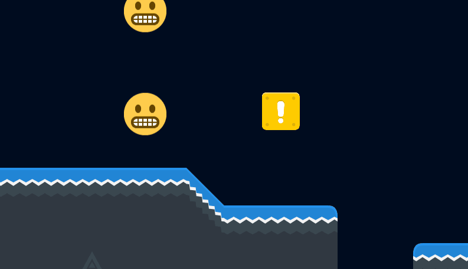
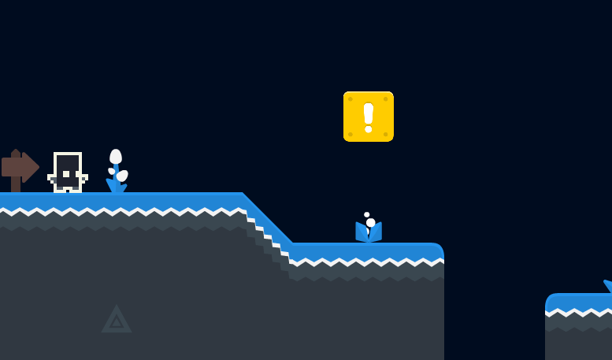
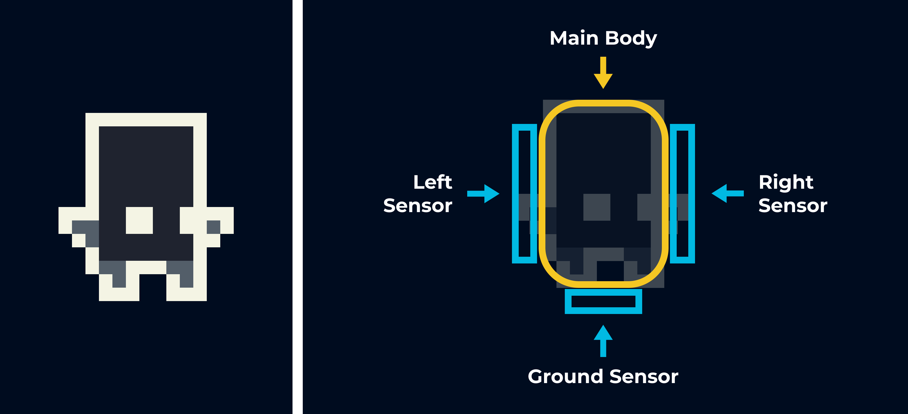
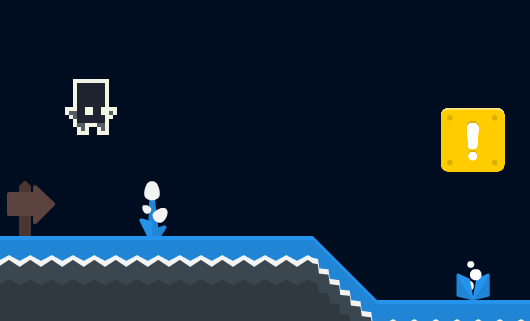
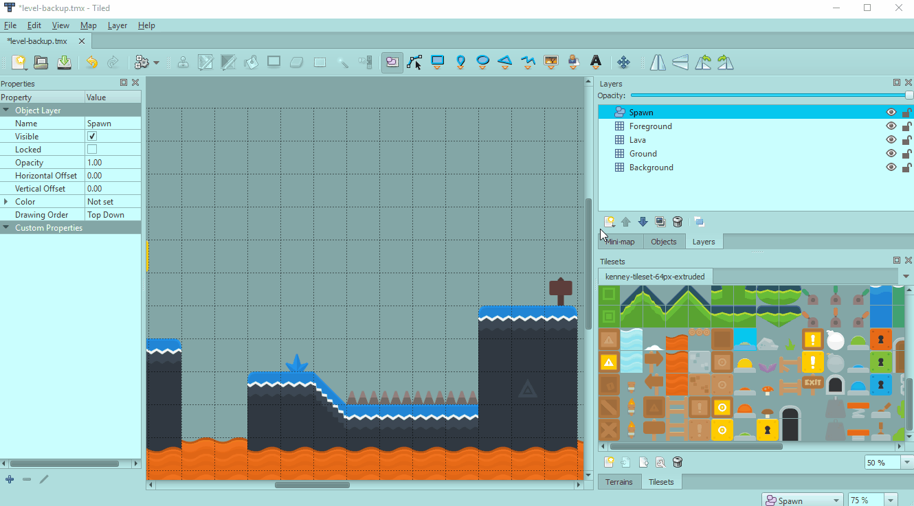
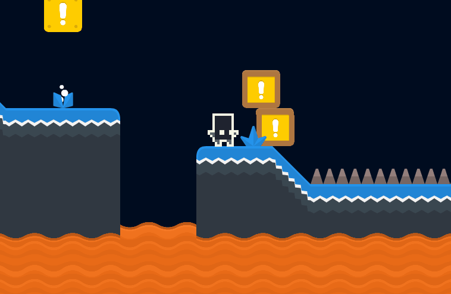
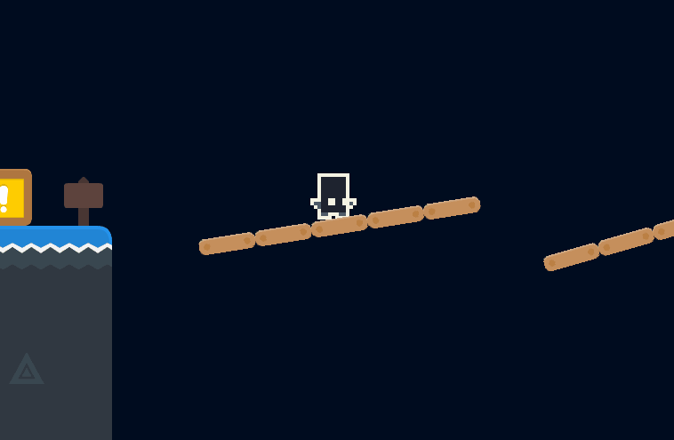
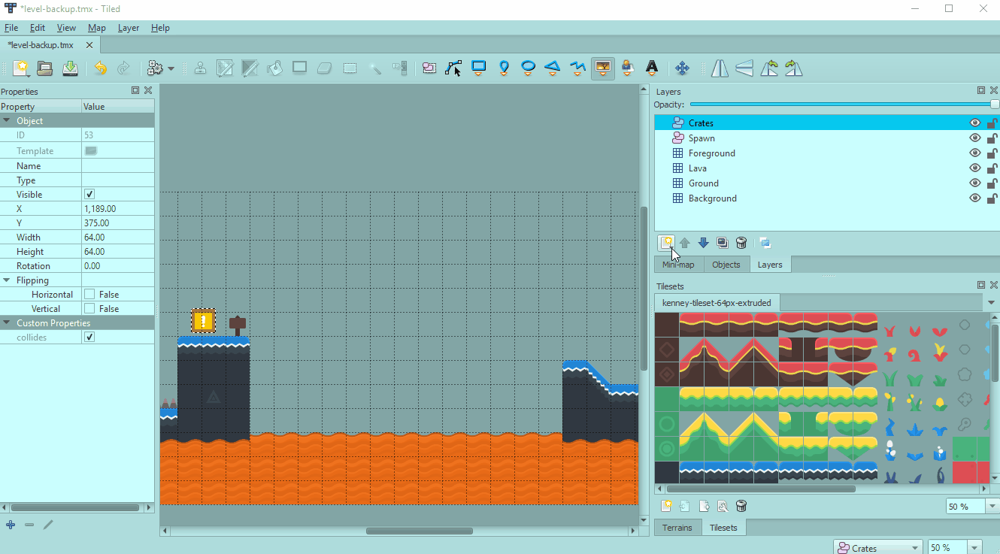
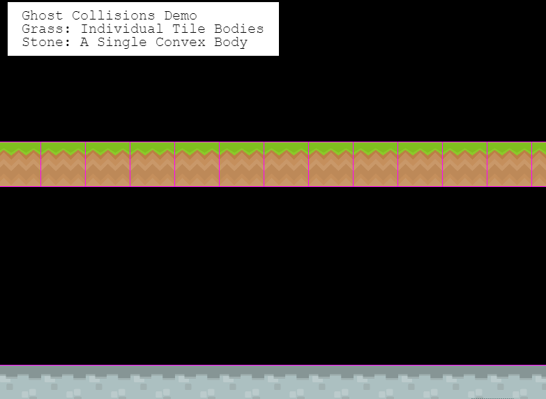

# Modular Game Worlds in Phaser 3 (Tilemaps #5) - Matter Physics Platformer

Author: [Mike Hadley](https://www.mikewesthad.com/)

Reading this on GitHub? Check out the [medium post](https://medium.com/@michaelwesthadley/modular-game-worlds-in-phaser-3-tilemaps-5-matter-physics-platformer-d14d1f614557).

This is the fifth (and final!) post in a series of blog posts about creating modular worlds with tilemaps in the [Phaser 3](http://phaser.io/) game engine. In this edition, we'll step up our [Matter.js](http://brm.io/matter-js/) knowledge and create a little puzzle-y platformer:


_↳ Pushing crates around to avoid spikes and hopping over seesaw platforms_

If you haven't checked out the previous posts in the series, here are the links:

1.  [Static tilemaps & a Pokémon-style world](https://medium.com/@michaelwesthadley/modular-game-worlds-in-phaser-3-tilemaps-1-958fc7e6bbd6)
2.  [Dynamic tilemaps & puzzle-y platformer](https://medium.com/@michaelwesthadley/modular-game-worlds-in-phaser-3-tilemaps-2-dynamic-platformer-3d68e73d494a)
3.  [Dynamic tilemaps & Procedural Dungeons](https://medium.com/@michaelwesthadley/modular-game-worlds-in-phaser-3-tilemaps-3-procedural-dungeon-3bc19b841cd)
4.  [Meet Matter.js](https://medium.com/@michaelwesthadley/modular-game-worlds-in-phaser-3-tilemaps-4-meet-matter-js-abf4dfa65ca1)

Before we dive in, all the source code and assets that go along with this post can be found in [this repository](https://github.com/mikewesthad/phaser-3-tilemap-blog-posts/tree/master/examples/post-5).

A quick note for following along with Tiled: A recent release of Tiled (version 1.2) changed the map export format in a way that breaks Phaser's map importing. If you are running into problems loading your maps (especially if collision info isn't loading), make sure you are using at least Phaser 3.14.0.

## Intended Audience

This post will make the most sense if you have some experience with JavaScript (classes, arrow functions & modules), Phaser and the [Tiled](https://www.mapeditor.org/) map editor. If you don't, you might want to start at the beginning of the [series](https://medium.com/@michaelwesthadley/modular-game-worlds-in-phaser-3-tilemaps-1-958fc7e6bbd6), or continue reading and keep Google, the Phaser tutorial and the Phaser [examples](https://labs.phaser.io/) & [documentation](https://photonstorm.github.io/phaser3-docs/index.html) handy.

Alright, Let's get into it!

## Overview

In the [last post](https://medium.com/@michaelwesthadley/modular-game-worlds-in-phaser-3-tilemaps-4-meet-matter-js-abf4dfa65ca1), we got acquainted with the Matter.js physics engine and played with dropping bouncy emoji around a scene. Now we're going to build on that Matter knowledge and step through building a 2D platformer. We'll learn how collisions work in Matter, get familiar with a plugin that will allow us to neatly watch for collisions in Phaser and then get into the core of the platformer.

## Collisions in Matter

The crux of what we are going to do revolves around handling Matter collisions. If we want to use physics in a game, we need to be able to respond when certain objects collide with one another, e.g. like a player character stepping on a trap door. Since Phaser's implementation of Matter is a thin wrapper around the underlying library, it's worth revisiting our vanilla Matter example from last time to learn about collision detection in Matter. If you are impatient, you _could_ jump ahead two sections to get straight to the platformer. But if you like to understand how something really works - which I think will pay off in the long run - then stick with me here.

Here's what we're aiming for in this section:


_↳ The shapes light up when they collide with each other, and they turn purple when they hit the floor._

Here's a [CodeSandbox starter project](https://codesandbox.io/s/kw73yy6375?module=%2Fjs%2Findex.js) that matches what we did last time. I'd recommend opening that up and coding along. There's a comment towards the bottom of the file that shows you where to start coding. The setup is the same as last time:

1. We create a renderer and engine.
2. We create some different shaped bodies that will bounce around the world.
3. We add some static bodies - bodies that are unable to move or rotate - to act as obstacles.
4. We add everything to the world and kick off the renderer & engine loops.

To start listening for collisions, we need to add a new module alias at the top of the file, `Events`:

```js
import { Engine, Render, World, Bodies, Body, Events } from "matter-js";

// Or when using Matter globally as a script:
// const { Engine, Render, World, Bodies, Body, Events } = Matter;
```

<!-- https://gist.github.com/mikewesthad/dfa0c1ccd23cdaa5e0d0ed2884ba5c39 -->

`Events` allows us to subscribe to event emitters in Matter. The two events we will play with in this demo are [`collisionStart`](http://brm.io/matter-js/docs/classes/Engine.html#event_collisionStart) and [`collisionEnd`](http://brm.io/matter-js/docs/classes/Engine.html#event_collisionEnd). (See the documentation for other [engine events](http://brm.io/matter-js/docs/classes/Engine.html#events).)

```js
Events.on(engine, "collisionStart", event => {
  event.pairs.forEach(pair => {
    const { bodyA, bodyB } = pair;
  });
});

Events.on(engine, "collisionEnd", event => {
  event.pairs.forEach(pair => {
    const { bodyA, bodyB } = pair;
  });
});
```

<!-- https://gist.github.com/mikewesthad/9ee3ff826228a822065de951da844cea -->

On each tick of the engine's loop, Matter keeps track of all pairs of objects that just started colliding (`collisionStart`), have continued colliding for multiple ticks (`collisionActive`) or just finished colliding (`collisionEnd`). The events have the same structure. Each provides a single argument - an object - with a `pairs` property that is an array of all pairs of Matter bodies that were colliding. Each `pair` has `bodyA` and `bodyB` properties that give us access to which two bodies collided. Inside of our event listener, we can loop over all the pairs, look for collisions we care about and do something. Let's start by making anything that collides slightly transparent (using the body's [render property](http://brm.io/matter-js/docs/classes/Body.html#property_render)):

```js
Events.on(engine, "collisionStart", event => {
  event.pairs.forEach(pair => {
    const { bodyA, bodyB } = pair;

    // Make translucent until collisionEnd
    bodyA.render.opacity = 0.75;
    bodyB.render.opacity = 0.75;
  });
});

Events.on(engine, "collisionEnd", event => {
  event.pairs.forEach(pair => {
    const { bodyA, bodyB } = pair;

    // Return to opaque
    bodyA.render.opacity = 1;
    bodyB.render.opacity = 1;
  });
});
```

<!-- https://gist.github.com/mikewesthad/e4cb0358c2b7615cbd27df3a345ec88a -->

Now we can extend our `collisionStart` to have some conditional logic based on which bodies are colliding:

```js
Events.on(engine, "collisionStart", event => {
  event.pairs.forEach(pair => {
    const { bodyA, bodyB } = pair;

    // Make translucent until collisionEnd
    bodyA.render.opacity = 0.75;
    bodyB.render.opacity = 0.75;

    // #1 Detecting collisions between the floor and anything else
    if (bodyA === floor || bodyB === floor) {
      console.log("Something hit the floor!");

      // The conditional ternary operator is a shorthand for an if-else conditional. Here, we use it
      // to access whichever body is not the floor.
      const otherBody = bodyB === floor ? bodyA : bodyB;
      otherBody.render.fillStyle = "#2E2B44";
    }

    // #2 Detecting collisions between the floor and the circle
    if ((bodyA === floor && bodyB === circle) || (bodyA === circle && bodyB === floor)) {
      console.log("Circle hit floor");

      const circleBody = bodyA === circle ? bodyA : bodyB;
      World.remove(engine.world, circleBody);
    }
  });
});
```

<!-- https://gist.github.com/mikewesthad/5544d538ab0e3ba00680c3433766bf1e -->

In the first conditional, we check if one of the bodies is the floor, then we adjust the color of the other body to match the floor color. In the second conditional, we check if the circle hit the floor, and if so, kill it. With those basics, we can do a lot in a game world - like checking if the player hit a button, or if any object fell into lava.

[](https://codesandbox.io/s/yqv0qqjoj9?hidenavigation=1&module=%2Fjs%2Findex.js&moduleview=1)

<!-- Embed link for medium: https://codesandbox.io/s/yqv0qqjoj9?hidenavigation=1&moduleview=1 -->

_↳ Check out the [CodeSandbox](https://codesandbox.io/s/yqv0qqjoj9?hidenavigation=1&module=%2Fjs%2Findex.js), [live example](https://www.mikewesthad.com/phaser-3-tilemap-blog-posts/post-5/01-native-matter-collision) or the source code [here](https://github.com/mikewesthad/phaser-3-tilemap-blog-posts/blob/master/examples/post-5/01-native-matter-collision)._

This approach isn't terribly friendly or modular though. We have to worry about the order of `bodyA` and `bodyB` - was the floor A or B? We also have to have a big centralized function that knows about all the colliding pairs. Matter takes the approach of keeping the engine itself as lean as possible and leaving it up to the user to add in their specific way of handling collisions. If you want to go further with Matter without Phaser, then check out this Matter plugin to that makes collision handling easier: [dxu/matter-collision-events](https://github.com/dxu/matter-collision-events#readme). When we get to Phaser, we'll similarly solve this with a plugin.

## Simple Collisions in Phaser

Now that we understand how collisions work in Matter, let's use them in Phaser. Before getting into creating a platformer, let's quickly revisit our emoji dropping example from last time:


_↳ Dropping emoji like last time, except now they get angry when they collide._

When an emoji collides with something, we'll make it play a short angry face animation. Here is another [starter template](https://codesandbox.io/s/l5ko8wo917?module=%2Fjs%2Fmain-scene.js) for this section where you can code along. It has a tilemap set up with Matter bodies on the tiles. Note: Phaser versions 3.11 and lower had a bug with Matter's `collisionEnd`, but it's patched now in 3.12 and up. The starter project uses 3.12.

When the player clicks on the screen, we will drop a Matter-enabled emoji. Last time we used a [`Phaser.Physics.Matter.Image`](https://photonstorm.github.io/phaser3-docs/Phaser.Physics.Matter.Image.html) for the emoji, but this time we'll use a [`Phaser.Physics.Matter.Sprite`](https://photonstorm.github.io/phaser3-docs/Phaser.Physics.Matter.Sprite.html) so that we can use an animation. This goes into our Scene's `create` method:

```js
// Drop some 1x grimacing emoji sprite when the mouse is pressed
this.input.on("pointerdown", () => {
  const worldPoint = this.input.activePointer.positionToCamera(this.cameras.main);
  const x = worldPoint.x + Phaser.Math.RND.integerInRange(-10, 10);
  const y = worldPoint.y + Phaser.Math.RND.integerInRange(-10, 10);

  // We're creating sprites this time, so that we can animate them
  this.matter.add
    .sprite(x, y, "emoji", "1f62c", { restitution: 1, friction: 0.25, shape: "circle" })
    .setScale(0.5);
});

// Create an angry emoji => grimace emoji animation
this.anims.create({
  key: "angry",
  frames: [{ key: "emoji", frame: "1f92c" }, { key: "emoji", frame: "1f62c" }],
  frameRate: 8,
  repeat: 0
});
```

<!-- https://gist.github.com/mikewesthad/0b1216b9cf4dee91327f456f94a04076 -->

Now we just need to handle the collisions (also in `create`):

```js
this.matter.world.on("collisionstart", event => {
  event.pairs.forEach(pair => {
    const { bodyA, bodyB } = pair;
  });
});

this.matter.world.on("collisionend", event => {
  event.pairs.forEach(pair => {
    const { bodyA, bodyB } = pair;
  });
});
```

<!-- https://gist.github.com/mikewesthad/1e0b83300b86bb1ff189a90a2e10acd0 -->

Familiar, right? The structure is pretty much the same as with native Matter, except that Phaser lowercases the event name to match its own conventions. `bodyA` and `bodyB` are Matter bodies, but with an added property. If the bodies are owned by a Phaser game object (like a Sprite, Image, Tile, etc.), they'll have a `gameObject` property. We can then use that property to identify what collided:

```js
this.matter.world.on("collisionstart", event => {
  event.pairs.forEach(pair => {
    const { bodyA, bodyB } = pair;

    const gameObjectA = bodyA.gameObject;
    const gameObjectB = bodyB.gameObject;

    const aIsEmoji = gameObjectA instanceof Phaser.Physics.Matter.Sprite;
    const bIsEmoji = gameObjectB instanceof Phaser.Physics.Matter.Sprite;

    if (aIsEmoji) {
      gameObjectA.setAlpha(0.5);
      gameObjectA.play("angry", false); // false = don't restart animation if it's already playing
    }
    if (bIsEmoji) {
      gameObjectB.setAlpha(0.5);
      gameObjectB.play("angry", false);
    }
  });
});
```

<!-- https://gist.github.com/mikewesthad/27d0fe0f6fe2e45512ab2addfa67bdc7 -->

We've got two types of colliding objects in our scene - sprites and tiles. We're using the [`instanceof`](https://developer.mozilla.org/en-US/docs/Web/JavaScript/Reference/Operators/instanceof) to figure out which bodies are the emoji sprites. We play an angry animation and make the sprite translucent. We can also use the `collisionend` event to make the sprite opaque again:

```js
this.matter.world.on("collisionend", event => {
  event.pairs.forEach(pair => {
    const { bodyA, bodyB } = pair;
    const gameObjectA = bodyA.gameObject;
    const gameObjectB = bodyB.gameObject;

    const aIsEmoji = gameObjectA instanceof Phaser.Physics.Matter.Sprite;
    const bIsEmoji = gameObjectB instanceof Phaser.Physics.Matter.Sprite;

    if (aIsEmoji) gameObjectA.setAlpha(1);
    if (bIsEmoji) gameObjectB.setAlpha(1);
  });
});
```

<!-- https://gist.github.com/mikewesthad/b625785d422e4a843c6c4cc4a82c4833 -->

[](https://codesandbox.io/s/810yw745v9?hidenavigation=1&module=%2Fjs%2Fmain-scene.js&moduleview=1)

<!-- Embed link for medium: https://codesandbox.io/s/810yw745v9?hidenavigation=1&module=%2Fjs%2Fmain-scene.js&moduleview=1 -->

_↳ Check out the [CodeSandbox](https://codesandbox.io/s/810yw745v9?hidenavigation=1&module=%2Fjs%2Fmain-scene.js), [live example](https://www.mikewesthad.com/phaser-3-tilemap-blog-posts/post-5/02-simple-phaser-collisions) or the source code [here](https://github.com/mikewesthad/phaser-3-tilemap-blog-posts/blob/master/examples/post-5/02-simple-phaser-collisions)._

Now we've seen native Matter events and Phaser's wrapper around those Matter events. Both are a bit messy to use without a better structure, but they are important to cover before we start using a plugin to help us manage the collisions. It's especially important if you decide you don't want to rely on my plugin 😉.

The approach in this section still isn't very modular. One function handles all our collisions. If we added more types of objects to the world, we'd need more conditionals in this function. We also haven't looked at how compound bodies would work here - spoiler, they add another layer of complexity.

## Collision Plugin

I created a Phaser plugin to make our lives a bit easier when it comes to Matter collisions in Phaser: [phaser-matter-collision-plugin](https://github.com/mikewesthad/phaser-matter-collision-plugin). We'll use it to build this (last stop before we step up the complexity with a platformer):



_↳ Love-hate collisions_

With the plugin, we can detect collisions between specific game objects, for example:

```js
const player = this.matter.add.sprite(0, 0, "player");
const trapDoor = this.matter.add.sprite(200, 0, "door");

this.matterCollision.addOnCollideStart({
  objectA: player,
  objectB: trapDoor,
  callback: () => console.log("Player touched door!")
});
```

<!-- https://gist.github.com/mikewesthad/ebc3f06876739e0fad16055069fe058b -->

Or between groups of game objects:

```js
const player = this.matter.add.sprite(0, 0, "player");
const enemy1 = this.matter.add.sprite(100, 0, "enemy");
const enemy2 = this.matter.add.sprite(200, 0, "enemy");
const enemy3 = this.matter.add.sprite(300, 0, "enemy");

this.matterCollision.addOnCollideStart({
  objectA: player,
  objectB: [enemy1, enemy2, enemy3],
  callback: eventData => {
    console.log("Player hit an enemy");
    // eventData.gameObjectB will be the specific enemy that was hit
  }
});
```

<!-- https://gist.github.com/mikewesthad/f6c915e2c76ceebac98af81c5f61d38f -->

Or between a game object and any other body:

```js
const player = this.matter.add.sprite(0, 0, "player");

this.matterCollision.addOnCollideStart({
  objectA: player,
  callback: eventData => {
    const { bodyB, gameObjectB } = eventData;
    console.log("Player touched something.");
    // bodyB will be the matter body that the player touched
    // gameObjectB will be the game object that owns bodyB, or undefined if there's no game object
  }
});
```

There are some other useful features - check out [the docs](https://www.mikewesthad.com/phaser-matter-collision-plugin/docs/manual/README.html) if you want to learn more. We'll be using it, and unpacking how it works, as we go.

Phaser's plugin system allows us to hook into the game engine in a structured way and add additional features. The collision plugin is a scene plugin (vs a global plugin, see [docs](https://photonstorm.github.io/phaser3-docs/Phaser.Plugins.PluginManager.html)), so an instance will be accessible on each scene after we've installed it via `this.matterCollision`.

Here's a [CodeSandbox starter project](https://codesandbox.io/s/316pq9j541?module=%2Fjs%2Findex.js) for coding along. It has the dependencies - Phaser and PhaserMatterCollisionPlugin - already installed as dependencies. (There are additional instructions [here](https://www.mikewesthad.com/phaser-matter-collision-plugin/docs/manual/README.html#installation) on how to load the plugin from a CDN or install it locally.)

Inside of index.js, we can load up the game with the plugin installed:

```js
import MainScene from "./main-scene.js";

const config = {
  type: Phaser.AUTO,
  width: 800,
  height: 600,
  backgroundColor: "#000c1f",
  parent: "game-container",
  scene: MainScene,
  physics: { default: "matter" },
  plugins: {
    scene: [
      {
        plugin: PhaserMatterCollisionPlugin, // The plugin class
        key: "matterCollision", // Where to store in Scene.Systems, e.g. scene.sys.matterCollision
        mapping: "matterCollision" // Where to store in the Scene, e.g. scene.matterCollision
      }
    ]
  }
};

const game = new Phaser.Game(config);
```

<!-- https://gist.github.com/mikewesthad/141336a6740a3966c0a72fd7736e292d -->

Then inside of main-scene.js, inside of `create`:

```js
// Create two simple animations - one angry => grimace emoji and one heart eyes => grimace
this.anims.create({
  key: "angry",
  frames: [{ key: "emoji", frame: "1f92c" }, { key: "emoji", frame: "1f62c" }],
  frameRate: 3,
  repeat: 0
});
this.anims.create({
  key: "love",
  frames: [{ key: "emoji", frame: "1f60d" }, { key: "emoji", frame: "1f62c" }],
  frameRate: 3,
  repeat: 0
});

const bodyOptions = { restitution: 1, friction: 0, shape: "circle" };
const emoji1 = this.matter.add.sprite(250, 100, "emoji", "1f62c", bodyOptions);
const emoji2 = this.matter.add.sprite(250, 275, "emoji", "1f62c", bodyOptions);

// Use the plugin to only listen for collisions between emoji 1 & 2
this.matterCollision.addOnCollideStart({
  objectA: emoji1,
  objectB: emoji2,
  callback: ({ gameObjectA, gameObjectB }) => {
    gameObjectA.play("angry", false); // gameObjectA will always match the given "objectA"
    gameObjectB.play("love", false); // gameObjectB will always match the given "objectB"
  }
});
```

<!-- https://gist.github.com/mikewesthad/f285471b02bd781b9dc425e43ee78de7 -->

Now we don't have to worry about which order the colliding pair is in, or finding the attached game object (or dealing with compound bodies). We can organize pieces of our collision logic within classes/modules as we see fit - like having the player listen for collisions that it cares about within player.js.

Here's the final code, with a little extra added in to make the emojis draggable:

[](https://codesandbox.io/s/v829vxpp8l?hidenavigation=1&module=%2Fjs%2Findex.js&moduleview=1)

<!-- Embed link for medium: https://codesandbox.io/s/v829vxpp8l?hidenavigation=1&module=%2Fjs%2Findex.js&moduleview=1 -->

_↳ Check out the [CodeSandbox](https://codesandbox.io/s/v829vxpp8l?hidenavigation=1&module=%2Fjs%2Findex.js), [live example](https://www.mikewesthad.com/phaser-3-tilemap-blog-posts/post-5/03-plugin-setup) or the source code [here](https://github.com/mikewesthad/phaser-3-tilemap-blog-posts/blob/master/examples/post-5/03-plugin-setup)_

## Platformer: Creating the Player

Now that we've got the fundamentals of collisions under our belts, we can tackle something more complicated - a platformer. We'll build it in pieces, starting with the Player class. In this first section we'll end up with:



Here's the last [starter CodeSandbox project](https://codesandbox.io/s/pmkmj7r8lm?module=%2Fjs%2Fplayer.js) which you can use to code along for the rest of the post. It already has a map loaded up with collisions and has empty files for the different modules we'll be creating.

We're going to start by creating our platforming "player.js" file. One of the challenges that comes with realistic physics engines like Matter is that they can be hard to control in predictable way in a game context. In contrast to our platformer from [post two](https://itnext.io/modular-game-worlds-in-phaser-3-tilemaps-2-dynamic-platformer-3d68e73d494a) which had a single rectangle body, this character will have a compound body with four parts:



Our player is composed of a main body and three sensors. The main body will be like the rectangle bodies we've created before, except that it will have rounded corners (chamfer). This helps smooth out collisions (this will make more sense later). As for the other three parts, a sensor is a body that doesn't react physically with other bodies in the world, but still triggers collisions. These will allow us to implement some special logic - e.g. the sensor below the player will let us tell if the player is currently on the ground.

Jumping into the code, we're going to need to rely on the native Matter API, accessible under `Phaser.Physics.Matter.Matter` (yeah, double Matter), to build the body:

```js
export default class Player {
  constructor(scene, x, y) {
    this.scene = scene;

    // Create the physics-based sprite that we will move around and animate
    this.sprite = scene.matter.add.sprite(0, 0, "player", 0);

    const { Body, Bodies } = Phaser.Physics.Matter.Matter; // Native Matter modules
    const { width: w, height: h } = this.sprite;
    const mainBody = Bodies.rectangle(0, 0, w * 0.6, h, { chamfer: { radius: 10 } });
    this.sensors = {
      bottom: Bodies.rectangle(0, h * 0.5, w * 0.25, 2, { isSensor: true }),
      left: Bodies.rectangle(-w * 0.35, 0, 2, h * 0.5, { isSensor: true }),
      right: Bodies.rectangle(w * 0.35, 0, 2, h * 0.5, { isSensor: true })
    };
    const compoundBody = Body.create({
      parts: [mainBody, this.sensors.bottom, this.sensors.left, this.sensors.right],
      frictionStatic: 0,
      frictionAir: 0.02,
      friction: 0.1
    });
    this.sprite
      .setExistingBody(compoundBody)
      .setScale(2)
      .setFixedRotation() // Sets inertia to infinity so the player can't rotate
      .setPosition(x, y);
  }
}
```

<!-- https://gist.github.com/mikewesthad/a9346e881ee58f0fd2b5df0f6b2c0cf4 -->

And if we create the player in main-scene.js, loading its position from a Tiled object within our map (which is already in the level.json file in the starter template):

```js
import Player from "./player.js";

export default class MainScene extends Phaser.Scene {
  create() {
    // ... code omitted that sets up the tilemaps

    // The spawn point is set using a point object inside of Tiled (within the "Spawn" object layer)
    const { x, y } = map.findObject("Spawn", obj => obj.name === "Spawn Point");
    this.player = new Player(this, x, y);

    // Smoothly follow the player
    this.cameras.main.startFollow(this.player.sprite, false, 0.5, 0.5);
  }
}
```

<!-- https://gist.github.com/mikewesthad/c0263d2f44b19139d20ac315b6e61d12 -->

We'll end up with:



Let's go back to the Player class and add in some controls:

```js
import MultiKey from "./multi-key.js";

export default class Player {
  constructor(scene, x, y) {
    // ... previous code omitted

    // Track the keys
    const { LEFT, RIGHT, UP, A, D, W } = Phaser.Input.Keyboard.KeyCodes;
    this.leftInput = new MultiKey(scene, [LEFT, A]);
    this.rightInput = new MultiKey(scene, [RIGHT, D]);
    this.jumpInput = new MultiKey(scene, [UP, W]);

    this.scene.events.on("update", this.update, this);
  }

  update() {
    const sprite = this.sprite;
    const velocity = sprite.body.velocity;
    const isRightKeyDown = this.rightInput.isDown();
    const isLeftKeyDown = this.leftInput.isDown();
    const isJumpKeyDown = this.jumpInput.isDown();

    const moveForce = 0.01;

    if (isLeftKeyDown) {
      sprite.setFlipX(true);
      sprite.applyForce({ x: -moveForce, y: 0 });
    } else if (isRightKeyDown) {
      sprite.setFlipX(false);
      sprite.applyForce({ x: moveForce, y: 0 });
    }

    // Limit horizontal speed, without this the player's velocity would just keep increasing to
    // absurd speeds. We don't want to touch the vertical velocity though, so that we don't
    // interfere with gravity.
    if (velocity.x > 7) sprite.setVelocityX(7);
    else if (velocity.x < -7) sprite.setVelocityX(-7);

    if (isJumpKeyDown) {
      sprite.setVelocityY(-11);
    }
  }
}
```

<!-- https://gist.github.com/mikewesthad/132079de0b32fe343e2d35e873c37a89 -->

We've done a few things here. First, to make input handling a bit better, we're using a small class called `MultiKey` that I've provided for us. The source code is in the sandbox, but for our purposes, all we need to know is that we pass it as many Phaser keys as we want, and then the `isDown()` method will tell us if any of the keys are down. This makes it easy to have W/A/S/D keys or the arrow keys control the player.

Second, we hook the player's `update` method into the scene's life cycle: `this.scene.events.on("update", this.update, this)`. In previous posts, we manually called the player's update method, but now anytime the scene updates, the player will update on its own.

Lastly, inside of update, we apply a force to the player to move them horizontally in response to key input. Since we are applying a force any time the key is down, the velocity will keep increasing the longer we hold the key - all the way up to break neck speeds where the sprite flies off screen. We need to manually impose a (horizontal) speed limit. We also spike the y velocity in order to make the player jump.

We have a player moving around the world, but we have two problems. The first is that the player can jump while in mid-air, a.k.a. superman:


The second is that, because the player has a physical body with friction, the player can stick to a wall by jumping into it, a.k.a. spiderman:


This is where those sensors come in! We can use the ground sensor to know when the player is on the ground or in the air, so that we can solve the jumping problem. We can use the left/right sensors to know when the player is up against a wall, so that we can remove the spidey ability to stick to walls. We're going to have to modify a few things:

```js
import MultiKey from "./multi-key.js";

export default class Player {
  constructor(scene, x, y) {
    // ... previous code omitted

    // Track which sensors are touching something
    this.isTouching = { left: false, right: false, ground: false };

    // Jumping is going to have a cooldown
    this.canJump = true;
    this.jumpCooldownTimer = null;

    // Before matter's update, reset our record of which surfaces the player is touching.
    scene.matter.world.on("beforeupdate", this.resetTouching, this);

    // If a sensor just started colliding with something, or it continues to collide with something,
    // call onSensorCollide
    scene.matterCollision.addOnCollideStart({
      objectA: [this.sensors.bottom, this.sensors.left, this.sensors.right],
      callback: this.onSensorCollide,
      context: this
    });
    scene.matterCollision.addOnCollideActive({
      objectA: [this.sensors.bottom, this.sensors.left, this.sensors.right],
      callback: this.onSensorCollide,
      context: this
    });
  }

  onSensorCollide({ bodyA, bodyB, pair }) {
    if (bodyB.isSensor) return; // We only care about collisions with physical objects
    if (bodyA === this.sensors.left) {
      this.isTouching.left = true;
      if (pair.separation > 0.5) this.sprite.x += pair.separation - 0.5;
    } else if (bodyA === this.sensors.right) {
      this.isTouching.right = true;
      if (pair.separation > 0.5) this.sprite.x -= pair.separation - 0.5;
    } else if (bodyA === this.sensors.bottom) {
      this.isTouching.ground = true;
    }
  }

  resetTouching() {
    this.isTouching.left = false;
    this.isTouching.right = false;
    this.isTouching.ground = false;
  }
}
```

<!-- https://gist.github.com/mikewesthad/5f17692cf3d7e0cc229e28aa23c334d9 -->

We've added two properties - `canJump` & `jumpCooldownTimer` - that we'll use in update. We've also added `isTouching`, which is how we will track which sensors are touching something in the world. We hook into Matter's `beforeupdate` event, which runs before any collision events, to reset the `isTouching` fields back to `false`. Using the matter collision plugin, anytime a sensor hits another body in the scene, we mark the appropriate field of `isTouching` to `true`.

We're also using `pair.separation` from the Matter event. This tells us how far the bodies would have to move to no longer be colliding. We're pushing the player slightly away from any walls on the left or right side (but leaving 0.5px of overlap so that the sensor continues colliding). The player's `mainBody` - which is what physically interacts with the world - can no longer be pressed up against a wall, so the friction-sticking-to-walls problem is solved.

Back in update, we can change a few things:

```js
const sprite = this.sprite;
const velocity = sprite.body.velocity;
const isRightKeyDown = this.rightInput.isDown();
const isLeftKeyDown = this.leftInput.isDown();
const isJumpKeyDown = this.jumpInput.isDown();
const isOnGround = this.isTouching.ground;
const isInAir = !isOnGround;

// Adjust the movement so that the player is slower in the air
const moveForce = isOnGround ? 0.01 : 0.005;

if (isLeftKeyDown) {
  sprite.setFlipX(true);

  // Don't let the player push things left if they in the air
  if (!(isInAir && this.isTouching.left)) {
    sprite.applyForce({ x: -moveForce, y: 0 });
  }
} else if (isRightKeyDown) {
  sprite.setFlipX(false);

  // Don't let the player push things right if they in the air
  if (!(isInAir && this.isTouching.right)) {
    sprite.applyForce({ x: moveForce, y: 0 });
  }
}

// Limit horizontal speed, without this the player's velocity would just keep increasing to
// absurd speeds. We don't want to touch the vertical velocity though, so that we don't
// interfere with gravity.
if (velocity.x > 7) sprite.setVelocityX(7);
else if (velocity.x < -7) sprite.setVelocityX(-7);

if (isJumpKeyDown && this.canJump && isOnGround) {
  sprite.setVelocityY(-11);

  // Add a slight delay between jumps since the bottom sensor will still collide for a few
  // frames after a jump is initiated
  this.canJump = false;
  this.jumpCooldownTimer = this.scene.time.addEvent({
    delay: 250,
    callback: () => (this.canJump = true)
  });
}
```

<!-- https://gist.github.com/mikewesthad/567c2b7c541daafd385da0f2834b4ecf -->

We tweaked the move speed so that you move more slowly in the air and so that you can't push things around while in the air (important for when we add movable objects to the world). We also modified the jump so that you can only jump when the ground sensor is colliding with something. We've also used a Phaser timer to create a cooldown so that you have to wait 250ms between jumps.

Putting that all together:

[](https://codesandbox.io/s/5vlzl8j9vp?hidenavigation=1&module=%2Fjs%2Findex.js&moduleview=1)

<!-- Embed link for medium: https://codesandbox.io/s/5vlzl8j9vp?hidenavigation=1&module=%2Fjs%2Findex.js&moduleview=1 -->

_↳ Check out the [CodeSandbox](https://codesandbox.io/s/5vlzl8j9vp?hidenavigation=1&module=%2Fjs%2Findex.js), [live example](https://www.mikewesthad.com/phaser-3-tilemap-blog-posts/post-5/04-platformer-step-1) or the source code [here](https://github.com/mikewesthad/phaser-3-tilemap-blog-posts/blob/master/examples/post-5/04-platformer-step-1)_

I've added player animations in that sandbox, check out the `create` and `update` methods to see how they work.

## Tidy up On Shutdown & Destroy

We're going to want to add some more interactivity to our world. The first thing we'll add is the ability to kill the player and restart the scene when they land on lava or a spike. To do this, we need to be responsible and have the Player instance clean up after itself.

In the last tutorial, we had the scene handle cleaning up and destroying the player. Since we are hooking the player directly into events, we'll want the player to listen for `shutdown` and `destroy` Scene events. `shutdown` is triggered from calling [`this.scene.restart`](https://photonstorm.github.io/phaser3-docs/Phaser.Scenes.ScenePlugin.html#restart__anchor) or [`this.scene.stop`](https://photonstorm.github.io/phaser3-docs/Phaser.Scenes.ScenePlugin.html#stop__anchor) within a Scene. When stopped, the scene instance isn't destroyed, so if the scene is started again, it will go through `init` and `create` (but not the constructor). `destroy` kills the Scene instance, and if we start that Scene again, a new instance will be created. In either case, we're going to unsubscribe the listener from any events and destroy the player's sprite. Inside of player.js:

```js
export default class Player {
  create() {
    // ... our existing create code would be here

    this.destroyed = false;
    this.scene.events.on("update", this.update, this);
    this.scene.events.once("shutdown", this.destroy, this);
    this.scene.events.once("destroy", this.destroy, this);
  }

  update() {
    if (this.destroyed) return;

    // ... our existing update code would be here
  }

  destroy() {
    this.destroyed = true;

    // Event listeners
    this.scene.events.off("update", this.update, this);
    this.scene.events.off("shutdown", this.destroy, this);
    this.scene.events.off("destroy", this.destroy, this);
    if (this.scene.matter.world) {
      this.scene.matter.world.off("beforeupdate", this.resetTouching, this);
    }

    // Matter collision plugin
    const sensors = [this.sensors.bottom, this.sensors.left, this.sensors.right];
    this.scene.matterCollision.removeOnCollideStart({ objectA: sensors });
    this.scene.matterCollision.removeOnCollideActive({ objectA: sensors });

    // Don't want any timers triggering post-mortem
    if (this.jumpCooldownTimer) this.jumpCooldownTimer.destroy();

    this.sprite.destroy();
  }
}
```

<!-- https://gist.github.com/mikewesthad/d661519a234388fbb0c30ecdb4f86683 -->

We listen for shutdown and destroy, and in response, trigger the player's `destroy` method. This unsubscribes anything that could trigger code within Player - scene events, matter collision plugin callbacks, the timer. We also destroy the sprite. Even though this method is being called by scene events automatically, it's written in a way that we could decide to destroy the player at any point in time, irrespective of the scene events.

We've also added a `destroyed` flag to the code. This is necessary because of the way [EventEmitter3](https://github.com/primus/eventemitter3) works. When an event is triggered, any event listeners for the event are cached at the start of the event. So it's possible (and can happen often when working with physics) that a player that's destroyed during an update event may still receive one more update event. We could get around this with a plugin like [samme/phaser-update-plugin](https://github.com/samme/phaser-plugin-update), or a similar plugin that a friend and I created: [sporadic-labs/phaser-lifecycle-plugin](https://github.com/sporadic-labs/phaser-lifecycle-plugin). Both are proxies around scene events, so if you unsubscribe a listener through them, you can trust that the listener will not be invoked again from an event.

## Player vs Lethal Tiles

Whew, now we can continue building out the world by adding some simple physics-y puzzles. First up, let's kill the player when it lands on a spike or lava.


Inside of our MainScene:

```js
export default class MainScene extends Phaser.Scene {
  create() {
    // ... this goes after we created the player

    this.unsubscribePlayerCollide = this.matterCollision.addOnCollideStart({
      objectA: this.player.sprite,
      callback: this.onPlayerCollide,
      context: this
    });
  }

  onPlayerCollide({ gameObjectB }) {
    if (!gameObjectB || !(gameObjectB instanceof Phaser.Tilemaps.Tile)) return;

    const tile = gameObjectB;

    // Check the tile property set in Tiled (you could also just check the index if you aren't using
    // Tiled in your game)
    if (tile.properties.isLethal) {
      // Unsubscribe from collision events so that this logic is run only once
      this.unsubscribePlayerCollide();

      this.player.freeze();
      const cam = this.cameras.main;
      cam.fade(250, 0, 0, 0);
      cam.once("camerafadeoutcomplete", () => this.scene.restart());
    }
  }
}
```

<!-- https://gist.github.com/mikewesthad/d76ab3426eda096c1d843c6e4aaff331 -->

We're setting up the player's sprite to collide with anything in the world. When it does, we check if the thing it collided with (`gameObjectB`) is a tile. If it is, and it's a lethal tile (a tile property set up in Tiled - see ["Moving with Physics" section](https://medium.com/@michaelwesthadley/modular-game-worlds-in-phaser-3-tilemaps-1-958fc7e6bbd6#b92b) of post 1), we fade out and restart the scene.

The `freeze` method on the player (given in the starter template) simply makes the player's body static, so that it doesn't move for the duration of the fade. `unsubscribePlayerCollide` is really important here. This function - which is returned from `addOnCollideStart` - will remove the collision listener that we added, so that the player can only die once.

Here's the final platformer sandbox for this post (which includes the lethal tiles plus the code for the next sections):

[](https://codesandbox.io/s/j44k3844j3?hidenavigation=1&module=%2Fjs%2Findex.js&moduleview=1)

<!-- Embed link for medium: https://codesandbox.io/s/j44k3844j3?hidenavigation=1&module=%2Fjs%2Findex.js&moduleview=1 -->

_↳ Check out the [CodeSandbox](https://codesandbox.io/s/j44k3844j3?hidenavigation=1&module=%2Fjs%2Findex.js), [live example](https://www.mikewesthad.com/phaser-3-tilemap-blog-posts/post-5/04-platformer-step-2) or the source code [here](https://github.com/mikewesthad/phaser-3-tilemap-blog-posts/blob/master/examples/post-5/04-platformer-step-2)_

## Crates & Spikes Puzzle

The part of the map with the spikes isn't jumpable without some help. Let's create a really simple physics puzzle that shows off Matter. We'll place some crates in front of the player for them to knock down so they can cross the spikes. Because we're using Tiled to build the level, we'll use an object layer for this. It's already set up in the starter project, but here's how it was made:



_↳ Using the tile object tool which allows you to place tile graphics in the map_

```js
export default class MainScene extends Phaser.Scene {
  create() {
    // ... our existing code would be here

    // Load up some crates from the "Crates" object layer created in Tiled
    map.getObjectLayer("Crates").objects.forEach(crateObject => {
      const { x, y, width, height } = crateObject;

      // Tiled origin for its coordinate system is (0, 1), but we want coordinates relative to an
      // origin of (0.5, 0.5)
      this.matter.add
        .image(x + width / 2, y - height / 2, "block")
        .setBody({ shape: "rectangle", density: 0.001 });
    });
  }
}
```

<!-- https://gist.github.com/mikewesthad/19807d2029c2653544c1241a0e21e3c3 -->



## Constraints and Seesaw Platforms

We've got a large chasm filled with lava after the spikes, so let's add some rotating platforms to that area to create another simple physics puzzle. The platforms will use constraints to keep them pinned in space, but they will rotate freely:



Again, we'll use Tiled to pick the locations of these platforms:



_↳ Placing point objects, and holding CTRL to snap to grid locations_

Then we can use a yet-to-be created module to place platforms:

```js
import createRotatingPlatform from "./create-rotating-platform.js";

export default class MainScene extends Phaser.Scene {
  create() {
    // ... our existing code would be here

    // Create platforms at the point locations in the "Platform Locations" layer created in Tiled
    map.getObjectLayer("Platform Locations").objects.forEach(point => {
      createRotatingPlatform(this, point.x, point.y);
    });
  }
}
```

<!-- https://gist.github.com/mikewesthad/53fa4413646be0bf089d289c1e6fa890 -->

We want these platforms to stay in place like a static body, but we can't use a static body here since then the platforms couldn't rotate. Instead, we're going to use something called a constraint to pin the platforms to a fixed location. Check out the [constraints demo](http://brm.io/matter-js/demo/#constraints) and [source code](https://github.com/liabru/matter-js/blob/master/examples/constraints.js) from Matter.js. We can think of constraints as a way to express that a body should be linked invisibly to another body or point in space. The body will then try to stay a fixed distance (that you specify) from that other body or point.

In a new file "create-rotating-platform.js" we can export a function that creates platforms. (We don't really need a class here - we're just configuring a [TileSprite](https://photonstorm.github.io/phaser3-docs/Phaser.GameObjects.TileSprite.html).)

```js
export default function createRotatingPlatform(scene, x, y, numTiles = 5) {
  // A TileSprite is a Sprite whose texture repeats to fill the given width and height. We can use
  // this with an image from our tileset to create a platform composed of tiles:
  const platform = scene.add.tileSprite(x, y, 64 * numTiles, 18, "wooden-plank");

  scene.matter.add.gameObject(platform, {
    restitution: 0, // No bounciness
    frictionAir: 0, // Spin forever without slowing down from air resistance
    friction: 0.2, // A little extra friction so the player sticks better
    // Density sets the mass and inertia based on area - 0.001 is the default. We're going lower
    // here so that the platform tips/rotates easily
    density: 0.0005
  });

  // Alias the native Matter.js API
  const { Constraint } = Phaser.Physics.Matter.Matter;

  // Create a point constraint that pins the center of the platform to a fixed point in space, so
  // it can't move
  const constraint = Constraint.create({
    pointA: { x: platform.x, y: platform.y },
    bodyB: platform.body,
    length: 0
  });

  // We need to add the constraint to the Matter world to activate it
  scene.matter.world.add(constraint);

  // Give the platform a random initial tilt, as a hint to the player that these platforms rotate
  const sign = Math.random() < 0.5 ? -1 : 1;
  const angle = sign * Phaser.Math.Between(15, 25);
  platform.setAngle(angle);
}
```

<!-- https://gist.github.com/mikewesthad/a1170f06d3da27bc923ea280b2f89545 -->

We're taking advantage of [TileSprite](https://photonstorm.github.io/phaser3-docs/Phaser.GameObjects.TileSprite.html) so that we can use our tile assets (64 x 64 pixels) to create a platform in the world. I've just extracted an individual tile from the tileset for us and trimmed it down to 64 x 18 pixels.

Constraints can be a lot of fun. Anything we can do in vanilla Matter, we can do with Matter & Phaser. Check out Matter's [constraint documentation](http://brm.io/matter-js/docs/classes/Constraint.html) for more information.

Here's the final platformer sandbox for this post (includes the lethal tiles plus the next two sections):

[](https://codesandbox.io/s/j44k3844j3?hidenavigation=1&module=%2Fjs%2Findex.js&moduleview=1)

<!-- Embed link for medium: https://codesandbox.io/s/j44k3844j3?hidenavigation=1&module=%2Fjs%2Findex.js&moduleview=1 -->

_↳ Check out the [CodeSandbox](https://codesandbox.io/s/j44k3844j3?hidenavigation=1&module=%2Fjs%2Findex.js), [live example](https://www.mikewesthad.com/phaser-3-tilemap-blog-posts/post-5/04-platformer-step-2) or the source code [here](https://github.com/mikewesthad/phaser-3-tilemap-blog-posts/blob/master/examples/post-5/04-platformer-step-2)_

## Celebration Trigger

Great - we can get from the left side of the screen to the right side. Let's do something fun to celebrate when the player does that. We'll create an invisible sensor and drop celebratory emojis on the player when they hit the sensor:


Again, the sensor has already been created in the started project's level.json, but here's how it is made:


_↳ Using the rectangle object tool and giving this sensor a specific name so that it's easy to find in Phaser_

Then we can load that up and listen for collisions back in our scene:

```js
export default class MainScene extends Phaser.Scene {
  create() {
    // ... our existing code would be here

    // Create a sensor at the rectangle object created in Tiled (under the "Sensors" layer)
    const rect = map.findObject("Sensors", obj => obj.name === "Celebration");
    const celebrateSensor = this.matter.add.rectangle(
      rect.x + rect.width / 2,
      rect.y + rect.height / 2,
      rect.width,
      rect.height,
      {
        isSensor: true, // It shouldn't physically interact with other bodies
        isStatic: true // It shouldn't move
      }
    );
    this.unsubscribeCelebrate = this.matterCollision.addOnCollideStart({
      objectA: this.player.sprite,
      objectB: celebrateSensor,
      callback: this.onPlayerWin,
      context: this
    });
  }

  onPlayerWin() {
    // Celebrate only once
    this.unsubscribeCelebrate();

    // Drop some heart-eye emojis, of course
    for (let i = 0; i < 35; i++) {
      const x = this.player.sprite.x + Phaser.Math.RND.integerInRange(-50, 50);
      const y = this.player.sprite.y - 150 + Phaser.Math.RND.integerInRange(-10, 10);
      this.matter.add
        .image(x, y, "emoji", "1f60d", {
          restitution: 1,
          friction: 0,
          density: 0.0001,
          shape: "circle"
        })
        .setScale(0.5);
    }
  }
}
```

<!-- https://gist.github.com/mikewesthad/736def72e2a13ac4d53202a4b31abafc -->

This same idea of invisible sensors can be used to trigger buttons, falling platforms, loading the next level, etc.

And with that, we've got a nice little physics-y level that you could experiment with and extend.

The final platformer sandbox again (which includes this code):

<!-- Embed link for medium: https://codesandbox.io/s/j44k3844j3?hidenavigation=1&module=%2Fjs%2Findex.js&moduleview=1 -->

_↳ Check out the [CodeSandbox](https://codesandbox.io/s/j44k3844j3?hidenavigation=1&module=%2Fjs%2Findex.js), [live example](https://www.mikewesthad.com/phaser-3-tilemap-blog-posts/post-5/04-platformer-step-2) or the source code [here](https://github.com/mikewesthad/phaser-3-tilemap-blog-posts/blob/master/examples/post-5/04-platformer-step-2)_

## Ghost Collisions

At some point in exploring Matter, you might run into the common problem of ghost collisions. If you notice a player seemingly tripping over nothing as it walks along a platform of tiles, you are likely running into ghost collisions. Here's what they look like:



You can check out the corresponding live [demo](http://labs.phaser.io/view.html?src=src/game%20objects/tilemap/collision/matter%20ghost%20collisions.js) that I created on Phaser Labs. As the mushrooms move over the top platform, you can see that they catch on the vertical edge of the tiles. That's due to how physics engines resolve collisions. The engine sees the tiles as separate bodies when the mushroom collides against them. It doesn't know that they form a straight line and that the mushrooms shouldn't hit any of the vertical edges. Check out [this article](http://www.iforce2d.net/b2dtut/ghost-vertices) for more information and to see how Box2D solves for this.

There are a couple ways to mitigate this:

- Add chamfer to bodies, i.e. round the edges, like we did in this post or use circular bodies to reduce the impact of the ghost collisions.
- Map out your level's hitboxes in as few shapes as possible, instead of giving each tile a separate body. You can still use Tiled for this. Create an object layer, and fill it with shapes, convert those shapes to Matter bodies in Phaser. The demo code linked above does just that.
- Or, keep an eye on hexus/phaser-slopes. @hexus is almost done with a Phaser plugin for solving ghost collisions against tilemaps. It lets you keep your tiles as separate bodies, like we've done here, which is helpful if you need to do things like check if a particular colliding tile is something lethal like lava 💪🏽

## Series Finale

Thanks for reading. Hope you've enjoyed reading this series on modular game worlds.

While this series is over, I'll still be posting about Phaser 3, so if you've got feedback on the format, or there's something you'd like to see in future posts, let me know!

## About Me

I’m a creative developer & educator. I wrote the Tilemap API for Phaser 3 and created a ton of guided examples, but I wanted to collect all of that information into a more guided and digestible format so that people can more easily jump into Phaser 3. You can see more of my work and get in touch [here](https://www.mikewesthad.com/).
